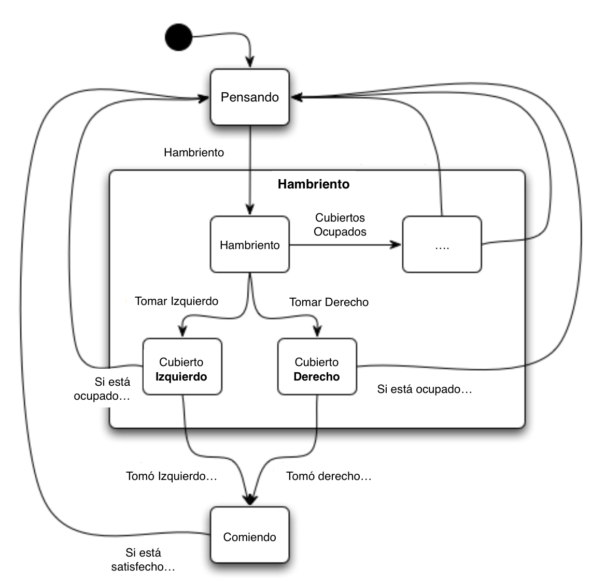

# Dining-Philosophers

**Cinco filósofos** se sientan silenciosamente alrededor de una mesa redonda, con platos llenos de spaghetti. Junto a cada filósofo se coloca un tenedor. Cada filósofo debe **alternarse entre pensar y comer**. Los filósofos puede comer únicamente cuando tienen ambos tenedores, derecho e izquierdo.


**Notas:**
- Cada **tenedor** puede ser sujetado únicamente por **un filósofo** a la vez.
- Cuando **un filósofo** termina de comer pone **ambos tenedores** sobre la mesa.
  - Estos **tenedores** ahora están disponibles para los demás.
- **Un filósofo** puede tomar el **tenedor de la derecha** o la **izquierda**.
  - **No puede comenzar** a comer hasta tener ambos.



# Contenido
- **[Antes de comenzar](#antesde)**
  - [Herramientas sugeridas](#herramientas)
  - [Instalación](#instalacion)
- **[Actividad 1 - Análisis](#analisis)**
- **[Actividad 2 - Desarrollo](#desarrollo)**
- **[Actividad 3 - Limpieza](#limpieza)**
- **[Actividad 4 - Preguntas](#preguntas)**

# Antes de comenzar

#### <a name="herramientas"></a>Herramientas sugeridas:
- Eclipse,IntelliJ u otro entorno de desarrollo.
- Java 1.7 ó superior.
- Conocimientos intermedios de **Programación Orientada a Objetos**.

#### <a name="instalacion"></a>Instalación:
1. Clonar el repositorio.
2. Crear en el **IDE** de su preferencia nuevos proyectos importando los proyectos clonados del repositorio.

# <a name="analisis"></a>Actividad 1 - Análisis Dining Philosophers

Ésta actividad consiste en comprender el funcionamiento del problema de los filósofos. Para esto deberás **completar** el código en la aplicación Java **DiningPhilosophers**, instrucciones:

- Abrir el proyecto **DiningPhilosophers**.
- Analizar las clases **CenaFilosofo.java** y **Filosofo.java**.
- Analizar **atentamente** los métodos y la documentación.
- Completar el código faltante.

**Nota importante:** Éste primer ejercicio ilustra el comportamiento de una aplicación que causa un **deadlock**.

Para la representación de los tenedores (Recursos compartidos) se emplearon Locks.
Un lock controla el acceso de un recurso compartido a multiples hilos y asegura el acceso exclusivo a un solo Thread a la vez. Para esto cada un hilo envia la señal de bloqueo (lock) cuando desea hacer uso del recurso (Tenedor), en caso de estar ocupado por otro hilo este se queda en una cola de espera. Una vez que desocupa el recurso envia una señal de desploqueo (unlock) para liberarlo y permitir que otro hilo lo pueda utilizar (para comer). 

El uso basico de Lock en Java es el siguiente:

Crear lock:
```
Lock nuevoLock = new ReentrantLock();
```
Bloquear recurso:
```
nuevoLock.lock();
```
Desbloquear recurso:
```
nuevoLock.unlock();
```
**Analiza** el comportamiento si:
- Ejecutas la aplicación con 1, 2, 3, 4, y 5 filósofos.
- Es **importante** que anotes tus observaciones de ésta actividad en tu **reporte**.

# <a name="desarrollo"></a>Actividad 2 - Análisis Dining Philosophers Monitor


Ésta actividad consiste en comprender el funcionamiento de un **monitor** para resolver **el problema de los filósofos**. Para esto deberás **completar** el código en la aplicación Java **DiningPhilosophersMonitor**, instrucciones:

- Abrir el proyecto **DiningPhilosophersMonitor**.
- Analizar las clases **CenaFilosofo.java**, **Monitor.java** y **Filosofo.java**.
- Analizar **atentamente** los métodos y la documentación.
- Completar el código faltante.

**Nota importante:** Éste segundo ejercicio ilustra el comportamiento de una aplicación que utiliza un **monitor** para evitar un **deadlock**, sin embargo los filósofos aún podrían morir de hambre **(Starvation)**.

**Analiza** el comportamiento si:
- Ejecutas la aplicación con 1, 2, 3, 4, y 5 **filósofos**.
- Ejecutas la aplicación con 3, 5 ó 7 **tenedores**.
- En el código se omite el uso de **Synchronized en los métodos**.
- Es **importante** que anotes tus observaciones de ésta actividad en tu **reporte**.

# <a name="limpieza"></a>Actividad 3 - Limpieza

La actividad está prácticamente terminada, sin embargo revisa y limpia el código identificando los métodos que has implementado.

- **Identificar** los métodos implementados para ambos proyectos.
- **Eliminar** los bloques de código que digan **"Completar código"**
- **Modificar** la documentación al inicio de cada clase con tus datos personales.
- Recordando que la documentación debe ser siguiendo las guías de [Javadocs](http://en.wikipedia.org/wiki/Javadoc)

# <a name="preguntas"></a>Actividad 4 - Preguntas

En el reporte de ésta práctica, además de mostrar y explicar el desarrollo de las actividades deberás responder a las siguientes preguntas:

- ¿Cuál es la diferencia entre **Wait()** y **Sleep()**?
- ¿Para qué se utiliza **Lock**?
- ¿Cuál es la diferencia entre **Runnable()** y **Thread()**?
- ¿Por qué es importante el uso de **Synchronized**?
- ¿Cuál es la diferencia entre un **Semáforo** y un **Monitor**?
- ¿Por qué los filósofos aún podrían morir de hambre **(Starvation)** en el ejercicio con el monitor?

**Notas:** Explica ampliamente y justifica tus respuestas.

**Cualquier comentario o duda, discutir en la sección de [issues](https://github.com/Innova4DLab/Dining-Philosophers/issues).**
