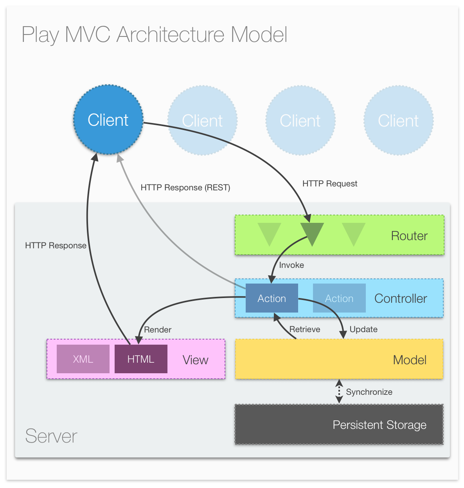
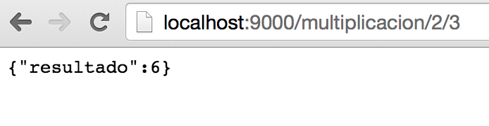

# Web Services con Play

<a href="https://www.playframework.com/">PLAY</a> es un framework de código abierto para el desarrollo de aplicaciones Web bajo el uso estricto del patrón modelo-vista-controlador (MVC). Play es muy competente para el desarrollo de servicios Web debido a su uso por defecto de servicios <a href="http://restful-api-design.readthedocs.org/en/latest/intro.html">RESTful</a>, completa integración con Json y la forzosa implementación de MVC. Debido a esto Play permite que bajo su arquitectura los servicios Web sean muy fáciles de implementar.

Alternativas interesantes a Play:
- <a href="http://www.django-rest-framework.org/">Django</a>
- <a href="http://sailsjs.org/#!/">Sails.js</a>
- <a href="https://www.meteor.com/">Meteor.js</a>

# Contenido
- **[Antes de comenzar](#antesde)**
- **[Herramientas sugeridas](#herramientas)**
- **[Instalación](#instalacion)**
- **[Actividad 1 - Análisis](#analisis)**
- **[Actividad 2 - Desarrollo](#desarrollo)**
- **[Actividad 3 - Limpieza](#limpieza)**
- **[Actividad 4 - Preguntas](#preguntas)**

# Antes de comenzar

### <a name="herramientas"></a>Herramientas sugeridas:
- **Eclipse**, **IntelliJ** u otro editor como <a href="https://atom.io/">(Atom)</a>.
- Si utilizan Mac es recomendable usar <a href="http://brew.sh/">**Homebrew**</a>.
- **JDK 6** ó superior.
- Conocimientos de Programación Orientada a Objetos.
- Se recomienda instalar <a href="http://www.scala-sbt.org/">SBT</a>.

### <a name="instalacion"></a>Instalación de 'activator':

**Activator** es una herramienta de construcción de software que incluye manejo de dependencias, herramientas de compilación, pruebas, implementación e integración. Activator está diseñado para proyectos de **Scala** y **Java**. Activator es de código abierto y fue desarrollado por Lightbend (antes llamada Typesafe) y es la herramienta de construcción por default para PLAY.

Linux Ubuntu:  
```Bash
$ apt-get install typesafe-activator
```

Mac OSX:
```Bash
$ brew install typesafe-activator
```

Windows:
- Descargar el instalador de typesafe-activator: https://downloads.typesafe.com/typesafe-activator/1.3.12/typesafe-activator-1.3.12.zip
- Descomprimir el archivo que contiene una carpeta (activator-dist-1.3.12) y moverla a "C:/".

Instalar Play:
- Descargar el instalador de Play <a href="https://www.playframework.com/">aquí</a>.
- Ejecutar el archivo **.bat**
- Agregar activator a la variable **Path**.

### Agregar activator a la variable de entorno:

Abrir una línea de comandos como administrador.
 1. Presionar la tecla windows.
 2. Escribir "cmd"
 3. Presionar click derecho sobre el icono de consola.
 4. Seleccionar "Ejecutar como administrador".


Ejecutar el siguiente comando (con la ruta de Typesafe-Activator):
- setx PATH "%PATH%;C:/activator-dist-1.3.12/bin"

# <a name="analisis"></a>Actividad 1 - Tutorial de Servicios Web

La instalación ya nos permite ejecutar el comando **activator** en la consola:

- Para crear un nuevo proyecto basta con ejecutar en la consola el comando **activator** + **new**:

```Bash
$ activator new
```
Se ejecuta un script que nos preguntará las siguientes opciones:
- De la lista que aparece **seleccionar** la opción **(5) Java-Play**.
- **Escoger** un nombre para nuestra aplicación, ejemplo: "**play-java-webservices**"
- **Cambiar** al directorio donde se creó el **template**.

```Bash
$ cd play-java-webservices
```

Si observas en el explorador deberías de ver la siguiente estructura:

```Bash
app/
conf/
project/
public/
test/
```
Esta es la estructura básica de una aplicación de PLAY:
 - En la carpeta **app** está el código fuente divido según el patrón Model-View-Controller
 - En la carpeta **conf** aquí está un archivo de configuración
 - En la carpeta **project** está un archivo de propiedades y otro en donde se escriben los plugins necesarios
 - En la carpeta **public** se encontrarán los recursos de imágenes, javascript y hojas de estilo en cascada
 - En la carpeta **test** se escriben las pruebas unitarias
 

Ahora ejecutaremos la aplicación mediante **activator** + **run** (Si es la primera vez, es posible que se descarguen algunas dependencias). Por default la aplicación levanta el servicio en el **puerto 9000**:

```Bash
$ activator run
```

- **Abrir** cualquier navegador y **escribir** en la barra de direcciones **"localhost:9000"**
- Se debería mostrar la página de Play con un mensaje. **"La aplicación está lista"**.
- **Abrir** la carpeta del proyecto en un editor o IDE de tu preferencia.
- **Analizar** la estructura de la aplicación.
- **Identificar** los componentes en la arquitectura de Play:



- Para continuar es importante identificar las carpetas del proyecto **"App -> Controllers"** y **"conf"**, ambas carpetas aparecen en root del proyecto.
- Dentro de **"conf"** existe un archivo llamado **routes**, dada la arquitectura de Play, analiza su contenido y explícalo en tu reporte.
- Dentro de **"App -> Controllers"** existe una clase llamada **Application**, la cual es una clase en donde podemos  definir la lógica **HTTP** de la aplicación, aquí es donde se van a definir los **Servicios Web**.
- Dentro de éste archivo edita la siguiente línea:

```Java
/*
* El siguiente método solamente despliega
* un mensaje dentro del template index.
*/
public static Result index() {
  return ok(index.render("Hola mundo, servicios web!!"));
}
```
- Guarda el archivo y actualiza **localhost:9000** en el navegador.
- Ahora procedemos a realizar nuestro **servicio Web**, dentro de la clase **Application** necesitamos importar algunas librerías:

```Java
import play.libs.Json;
import com.fasterxml.jackson.databind.JsonNode;
import com.fasterxml.jackson.databind.node.ObjectNode;
import play.api.libs.json.*;
```

- Agregamos un método dentro de la clase **Application**:

```Java
/*
* El siguiente método hace una multiplicación de enteros.
* @param a el primer  entero.
* @param b el segundo entero.
* @return Resultado en formato Json.
*/
public static Result getMultiplicacion(int a, int b){
  ObjectNode result = Json.newObject();
  result.put("resultado", a*b );
  return ok(result);
}
```

- Ahora ya tenemos la lógica de nuestro servicio **multiplicación**, pero para ponerlo en funcionamiento debemos ir a **routes** y agregar el método.
- **# Mis Servicios Web** es una línea de comentario para indicar el bloque donde inician las declaraciones de los servicios Web.
- El método multiplicación es de tipo **GET** por lo que definimos una ruta con nombre **/multiplicación** y  dos variables, **:a** y **:b**
- Por último, le indicamos la ubicación del método: **controllers.Application.getMultiplicación** pasamos las variables al método mediante **(a:Int, b:Int)**. El código se ve así:

```Bash
# Routes
# This file defines all application routes (Higher priority routes first)
# ~~~~

# Home page
GET     /                        controllers.Application.index()

# Mis Servicios Web

GET     /multiplicacion/:a/:b    controllers.Application.getMultiplicacion(a: Int,b: Int)

# Map static resources from the /public folder to the /assets URL path
GET     /assets/*file               controllers.Assets.at(path="/public", file)

```

- El servicio Web multiplicación está listo y es accesible a través de **localhost:9000/multiplicacion/2/3**:




- A continuación se muestra el código para implementar el método **palíndromo**:

```Java
/*
* El siguiente método verifica si una cadena es un palíndromo.
* @param word la palabra a validar.
* @return true o false en formato Json.
*/
public static Result getPalindromo(String word){
  ObjectNode result = Json.newObject();
  String myWord = word.replaceAll("\\s+","");
  String reverse = new StringBuffer(myWord).reverse().toString();
  result.put("resultado", reverse.equalsIgnoreCase(myWord));
  return ok(result);
}
```

- Dado el método **palíndromo** define el **enrutamiento** adecuado para crear un **servicio Web**.
- **Analizar** y **describir** el procedimiento en el **reporte**.

# <a name="desarrollo"></a>Actividad 2 - Implementación de Servicios Web

Una vez completado el tuturial es momento de poner en práctica el aprendizaje, como objetivo deberás realizar la implementación de algunos servicios **RESTful**. Cada servicio contiene una entrada y una salida, la salida debe ser en formato **JSON** como se realizó en el tutorial.

- Desarrollar un **Servicio Web** que convierta de **Dólares** a **pesos**.
- Desarrollar un **Servicio Web** que convierta de **Farenheit** a **Centígrados**.
- Desarrollar un **Servicio Web** que dado un **País Europeo**, regrese la **capital**.
- Desarrollar un **Servicio Web** que dado un **País Europeo**, regrese la **ubicación de la embajada de México**.
  - <a href="https://docs.google.com/spreadsheets/d/15z65g2wvjrj6Q-7S4oRhCNBbJhZuaT2SaVBtb2w822M/edit#gid=0">Lista</a> con ubicaciones de las **embajadas mexicanas** en **Europa**.

# <a name="limpieza"></a> Actividad 3 - Limpieza

Para comprender mejor las actividades recuerda **limpiar** y **documentar** correctamente el código. Por ejemplo, es importante afinar algunos detalles como escribir los nombres de variables y métodos de manera clara, es decir, nombres que representen e indiquen  explícitamente su **funcionalidad**. **Play Framework** utiliza Java, por lo tanto es muy fácil realizar la documentación mediante [Javadocs](http://en.wikipedia.org/wiki/Javadoc).

- Recordando que la documentación debe ser siguiendo las guías de [Javadocs](http://en.wikipedia.org/wiki/Javadoc).

# <a name="preguntas"></a>Actividad 4 - Preguntas

En el reporte de la práctica, además de mostrar y explicar el desarrollo de las actividades deberás responder a las siguientes preguntas:

- Explicar el funcionamiento del patrón arquitectónico **MVC**.
- Explicar los pasos para la creación de un servicio **REST** en **Play**.
- En la arquitectura de **Play** ¿Cuál es la función de **Router**?
- Explicar la funcionalidad del **controlador**.
- Explicar la diferencia entre **POST** y **GET**.
- Describir el procedimiento para crear un **servicio Web**.

**Notas:** Explica ampliamente y justifica tus respuestas.

**Cualquier comentario o duda, discutir en la sección de [issues](https://github.com/Innova4DLab/Dining-Philosophers/issues).**
