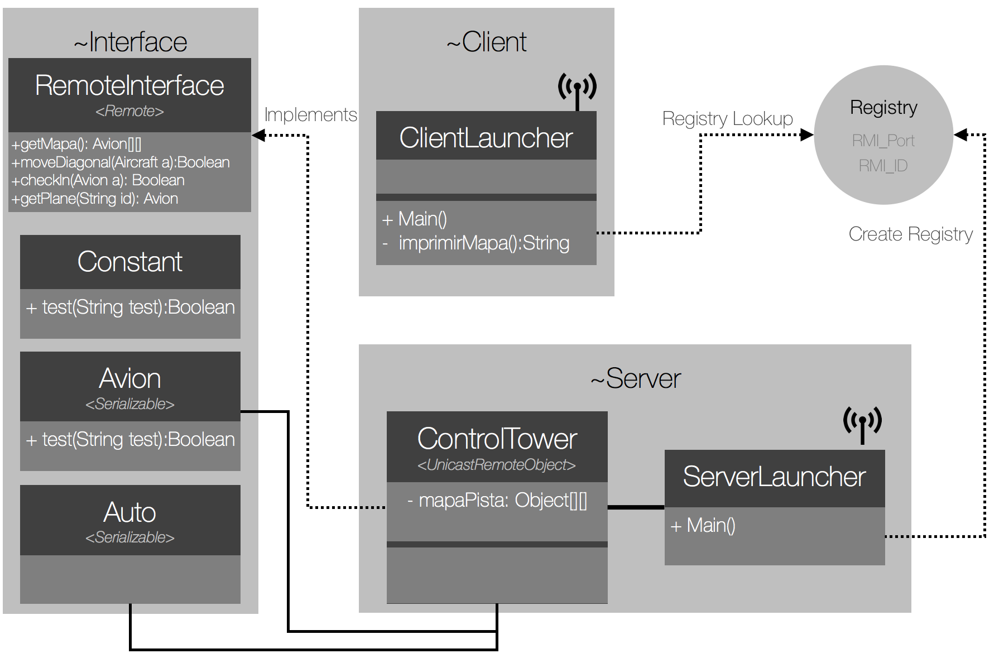
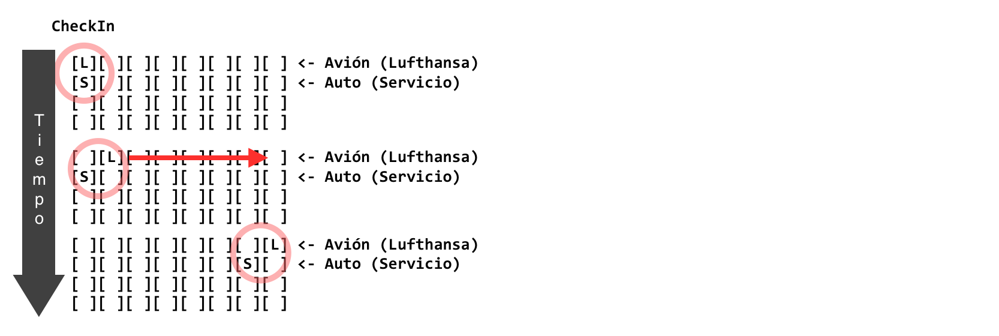
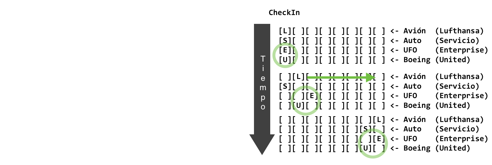
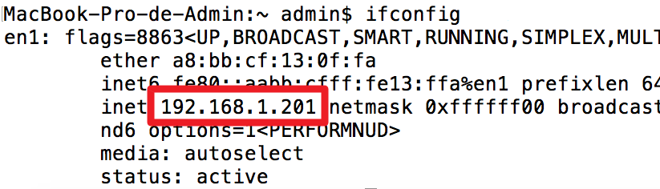
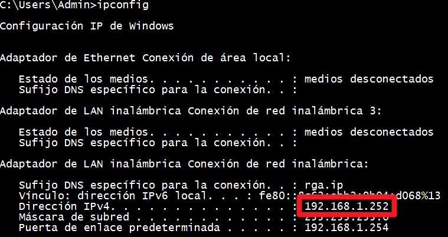
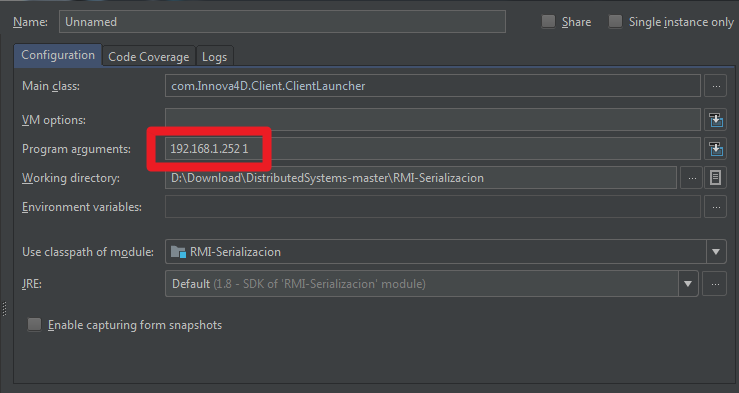

# Java RMI Sesión 2 (serialización y acceso múltiple al servidor)
>Java RMI (Remote Method Invocation), es una tecnología desarrollada por Java para invocar métodos remotos. Proporciona un mecanismo simple para la comunicación de servidores y clientes en aplicaciones distribuidas basadas en Java.
>La construcción de una aplicación distribuída con RMI incluye:  
- 1. Serialización (**Marshalling**) de parámetros y objetos en Java en el cliente para enviar al servidor.
- 2. Invocación desde el cliente, del **Método Remoto**  (RMI)  a ejecutar en el servidor.
- 3. Serialización (**Marshalling**) en el servidor para enviar respuesta al **Cliente**.
- 4. Recepción de la respuesta por parte del **Cliente** y ejecución local.  

La segunda sesión de RMI consiste en:
 - comprender mejor el Marshalling (Serialización de objetos) con RMI, y
 - probar el acceso al servidor desde múltiples clientes 
 **es muy importante** haber concluído la primera actividad antes de continuar.

# Contenido
- **[Antes de comenzar](#antesde)**
- [Herramientas sugeridas](#herramientas)
- [Instalación en IntelliJ IDEA](#instalacion)
- **[Actividad 1 - Análisis](#analisis)**
- **[Actividad 2 - Desarrollo](#desarrollo)**
- **[Actividad 3 - Prueba del servidor con múltiples clientes](#pruebas)**
- **[Actividad 4 - Limpieza](#limpieza)**
- **[Actividad 5 - Preguntas](#preguntas)**

#### Herramientas sugeridas:
- IntelliJ IDEA
- Java 1.6 ó superior.
- Conocimientos intermedios de Programación Orientada a Objetos.

#### Instalación en IntelliJ IDEA:
1. Clonar el repositorio.
2. Crear en Intellij Idea un nuevo proyecto (File>New>Project from existing Sources) a partir de la carpeta RMI-2.

# Actividad 1 - Análisis  

El presente repositorio contiene un proyecto que **simula la administración de la pista aérea de un Aeropuerto por una torre de control**. Los aviones, ó autos de servicio (**Clientes**) se suscriben a la torre de control (**Servidor**) que contiene un mapa de pista **[Matríz 4x8 Objetos]** en donde los vehículos se desplazan cada "x" segundos; cada vehículo (aéreo o terrestre) informa a la torre de control hacia a dónde se ha desplazado, la torre de control actualiza su **mapa de pista**, el **cliente interfaz de usuario** imprime cada segundo el **mapa aéreo** en la consola.

- Ejecutar **Server**: Click derecho sobre el proyecto, "**Run As** > **Java Application**".
- Ejecutar **Client**: Click derecho sobre el proyecto, "**Run As** > **Java Application**".
- Analizar el diagrama que muestra la arquitectura de la aplicación distribuída:

- Observar el comportamiento de la aplicación.
- Analizar la clase **RemoteInterface.java** y **ControlTower.java**.
- Analizar las clases **Avion.java** y **Auto.java**
- Explicar en el **reporte** la funcionalidad de la interfaz y cómo se implementa en el servidor.
- Explicar en el **reporte** el método **moverAvion(Avion a, int c)** que se encuentra en **ControlTower.java**
- Analizar el Cliente **ClientLauncher.java**.
- Explicar la funcionalidad del método **main**.
- Explicar los métodos **guiClient()** y **avionClient()**.

Nota: Inicialmente en la consola debería imprimirse un resultado de la siguiente forma:

# Actividad 2 - Desarrollo

En ésta actividad deberás modificar el **Proyecto** de Java que se te ha entregado. Como habrás analizado las clases **Avion** y **Auto** son objetos que se agregan a una **matríz 4x8** que repesenta una pista aérea, los métodos en el **servidor** permiten informar el desplazamiento de estos vehículos en la **matríz**. Los objetos son creados en el **cliente** y envíados al **servidor** en donde se actualiza su ubicación. El objetivo de ésta actividad es **definir** e **implementar** la lógica de dos nuevos objetos en el **servidor**, que se crearán, enviarán y controlarán desde el **Cliente**.

- Implementar 2 nuevas clases de vehículos (e.g, UFO, Boeing), para agregarlos a la pista (Matríz 4x8).
- Implementar los **2 nuevos objetos** en los **2 últimos carriles** disponibles de la matríz.
- Implementar en el servidor la lógica necesaria para las nuevas clases.
- Implementar en el cliente los vehículos, deben ejecutarse en su propio hilo cada "x" segundos.
- Documentar las nuevas clases agregadas y los nuevos métodos implementados.
- Utilizar las guías de JavaDocs.
- Es importante analizar el código, revisar atentamente el diagrama de clases, podría ser útil.

Nota: La consola debería imprimir algo así:

# Actividad 3 - Prueba del servidor con múltiples clientes

A fin de simular un entorno real deberás ejecutar el servidor (Torre de control) y 5 clientes (Auto, Avión, UFO, Boeing, Interfaz Gráfica) en máquinas independientes. Para lograr que la conexión entre cada cliente y el servidor sea exitosa deberas conectar todas las máquinas en una misma red (LAN).

1. Ejecutar la clase ServerLauncher en una máquina.

2. Obtener la dirección IP de la máquina que ejecute el servidor.
	- Mac OSX y Linux
		- 1.- Abrir una terminal de comandos presionando (CMD + Espacio), escribir "terminal" y presionar enter.
		- 2.- Escribir el comando ifconfig.
		
		
	- Windows
		- 1.- Abrir una consola de comandos presionando (Windows + R), escribir "cmd" y presionar enter.
		- 2.- Escribir el comando ipconfig.
		
		
3. Agregar los dos casos (case) faltantes correspondientes a los dos nuevos vehículos (UFO, Boeing) dentro de la estructura "Switch" que esta en la clase ClientLauncher.java (Línea 23). 

4. Ejecutar ClientLauncher en 5 máquinas distintas con los siguientes parámetros.
   - Máquina 1: \<Ip Servidor> 1
   - Máquina 2: \<Ip Servidor> 2
   - Máquina 3: \<Ip Servidor> 3
   - Máquina 4: \<Ip Servidor> 4
   - Máquina 5: \<Ip Servidor> 5
   
Nota: En Intellij Idea se pueden agregar parámetros de ejecución de la siguiente manera:
   Menu Run > Edit Configuration

    

Al iniciar la ejecución de todos los clientes podrás ver que en el cliente 3 (Interfaz Gráfica) se actualiza cada vehículo hasta acabar con su recorrido. 

# Actividad 4 - Limpieza

Ahora deberás limpiar el código, permitirá comprender de mejor manera la estructura del RMI.

- Identifica las clases **Client** y **Server**.
- Agrega la documentación a las clases con tu **nombre**, **correo** y **ID**.
- Agrega la documentación a las **variables** y **métodos** de cada **Interfaz/Clase**.
Nota:  La documentación debe ser siguiendo las guías de [Javadocs](http://en.wikipedia.org/wiki/Javadoc)

# Actividad 5 - Preguntas

En el reporte de ésta práctica, además de mostrar y explicar el desarrollo de las activiadaes deberás responder a las siguientes preguntas:

- ¿Cómo se definen nuevas clases para usarlas con **Server**?
- ¿Cuáles son los pasos necesarios para crear una nueva clase y utilizar el objeto en el Servidor?
- ¿Cuál es la utilidad de **Interface**?
- ¿Cuál es la utilidad de **Constant.java**?
- ¿Cuáles objeto(s) son Remotos? (Un objeto remoto es aquel cuyos métodos pueden ser invocados desde otra máquina virtual)
- ¿Cuáles objeto(s) son no-Remotos? (Un objeto no-remoto es aquel que es copiado via serialización o instanciado en la máquina virtual en la que va a ser utilizado)
- ¿Cómo se manejan los errores en el Servidor?
- ¿Cuál es la utilidad de la clase **RemoteException**?
- ¿Por qué es necesario utilizar **Serializable** en las nuevas clases?
- Dada la comunicación entre **Client** y **Server**
  - ¿Por qué es necesario que el método avionClient() y los objetos **RemoteInterface** y **Avion** sean de tipo **final**?
- ¿Por qué es necesario un método **getAvion(String id, int c)**?
- ¿Cómo se manejan los errores en el Cliente?
- ¿Qué significa y cuál es la utilidad de **NotBoundException**?

Notas:
- Explica ampliamente y justifica tus respuestas.
- La documentación debe ser siguiendo las guías de [Javadocs](http://en.wikipedia.org/wiki/Javadoc)

**Cualquier comentario o duda, discutir en la sección de [issues](https://github.com/Innova4DLab/RMI-2/issues).**
