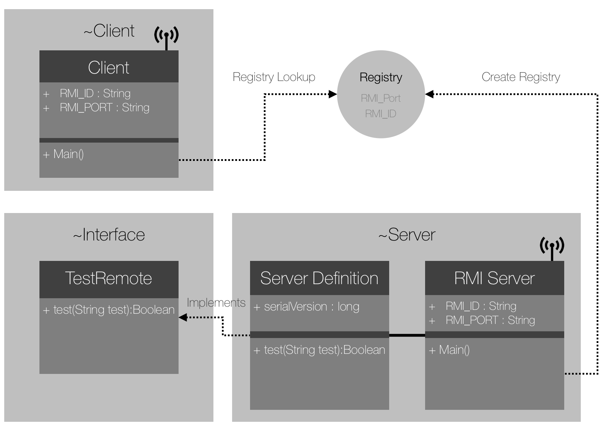

# Java RMI
>Java RMI (Remote Method Invocation), es una tecnología desarrollada por Java para invocar métodos remotos. Proporciona un mecanismo simple para la comunicación de Serveres y Clients en aplicaciones distribuidas basadas en Java.

La construcción de una aplicación distribuída con RMI incluye:   

1. Serialización (**Marshalling**) de parámetros y objetos en Java en el cliente para enviar al servidor
2. Invocación desde el cliente, del **Método Remoto**  (RMI)  a ejecutar en el servidor
3. Serialización (**Marshalling**) en el servidor para enviar respuesta al **Cliente**
4. Recepción de la respuesta por parte del **Cliente** y ejecución local

# Contenido
- **[Antes de comenzar](#antesde)**
  - [Herramientas sugeridas](#herramientas)
  - [Instalación en IntelliJ IDEA](#instalacion)
- **[Actividad 1 - Análisis](#analisis)**
- **[Actividad 2 - Desarrollo](#desarrollo)**
- **[Actividad 3 - Limpieza](#limpieza)**
- **[Actividad 4 - Preguntas](#preguntas)**

# Antes de comenzar

#### Herramientas sugeridas:
- IntelliJ IDEA
- Java 1.6 ó superior.
- Conocimientos intermedios de Programación Orientada a Objetos.

#### Instalación en IntelliJ IDEA:
1. Clonar el repositorio.
2. Crear en Intellij Idea un nuevo proyecto (File>New>Project from existing Sources) a partir de la carpeta RMI.

# Actividad 1 - Análisis

En **RMI** se definen **Client**, **Server** e **Interface**. La Interfaz define los métodos que deseamos implementar en Server. El **Cliente** solicita a **Server** los métodos que desea sean ejecutados a través de un registro que sólo debe realizarse una vez.

- Ejecutar **Server**: Click derecho sobre el proyecto, "**Run As** > **Java Application**".
- Ejecutar **Client**: Click derecho sobre el proyecto, "**Run As** > **Java Application**".
- Analizar el diagrama que muestra la arquitectura de la aplicación distribuída:

- Observar el comportamiento de la aplicación cuando el método remoto de prueba test se invoca con diferentes cadenas.
  - Analizar la clase **ServerDefinition.java** y **TestClient.java** para comprender los resultados.
  - Explicar en el **reporte** por qué aparecen como resultado **false** y **true**.

# Actividad 2 - Desarrollo

En ésta actividad deberás modificar el **Proyecto** de Java que se te ha entregado. Como habrás observado el proyecto ejecuta un método Test en el **Server**. El objetivo de ésta actividad es **definir** e **implementar** dos nuevos métodos en el Server que llamaremos desde el Client.

- Crear los siguientes métodos en la Interfaz **"TestRemote"**:
  - El **primer**  método debe recibir dos enteros, realizar una multiplicación y retornar el resultado.
  - El **segundo** método debe recibir un String y verificar si es un palíndromo, retornar true o false.
- Implementar los métodos en **Server**, en la clase **"ServerDefinition"**.
- Desarrollar el código necesario en **Client** para invocar remotamente estos métodos.
- Probar los métodos desde **Client** e imprimir el resultado en la **consola**.

# Actividad 3 - Limpieza

Ahora deberás limpiar el código, permitirá comprender de mejor manera la estructura del RMI.

- Identifica las clases **Client** y **Server**.
- Edita los comentarios con tu **nombre**, **correo** y **ID**.
- Agrega tus comentarios a las variables y métodos de cada **Interfaz/Clase**.

# Actividad 4 - Preguntas

En el reporte de ésta práctica, además de mostrar y exlicar el desarrollo de las actividades deberás reponder a las siguientes preguntas:
- ¿Cómo se logra la comunicación entre **Client** y **Server**?
- ¿Cómo se definen nuevos métodos en **Server**?
- ¿Cuáles son los pasos necesarios para registrar un nuevo método?
- ¿Cuál es la función de **Registry**?
- ¿Qué se hace y por qué es necesaria la **Interface**?
- Explique con terminología de Java qué hace esta línea ubicada en el código del cliente:  
  **TestRemote remote = (TestRemote) registry.lookup(RMI_ID)**
- ¿Cómo podrías ejecutar más **Clientes**?  

Notas:
- Explica ampliamente y justifica tus respuestas.
- La documentación debe ser siguiendo las guías de [Javadocs](http://en.wikipedia.org/wiki/Javadoc)

**Cualquier comentario o duda, discutir en la sección de [issues](https://github.com/Innova4DLab/RMI/issues).**
