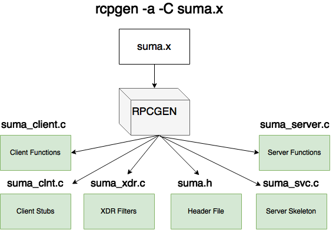
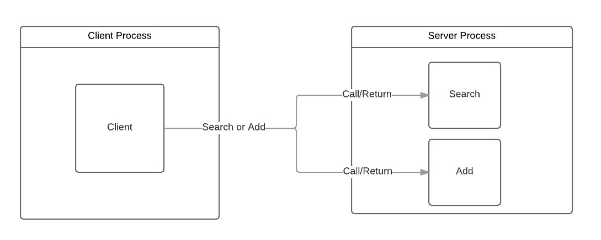

# RPCGEN
Es un pre-compilador generador de interfaces en C desarrollado por Sun. A partir de una especificación se crea código en C que permite inicializar un cliente y servidor.
>En 1984 Birrell y Nelson introducen una forma novedosa para administrar la comunicación entre un cliente y servidor, con una idea realmente simple. Ellos proponen permitir a los programas llamar procedimientos localizados en otras computadoras, cuando un proceso en una máquina (A) llama a un proceso en una máquina (B) el proceso en (A) es suspendido, la ejecución completa del procedimiento toma lugar en (B). La información es enviada en parámetros y regresa a través del resultado del proceso, ningún tipo de envío de mensajes es visible por el programador. A ésta metodología se le conoce como Remote Procedure Call (RPC).
>En esta práctica usaremos el rpcgen para generar los elementos requeridos del lado del cliente y del servidor para que comuniquen entre sí y desde el cliente se puedan solicitar los servicios del servidor.  En particular, desde el cliente se solicitará la suma de dos enteros y la operación se realizará del lado del servidor.
# Contenido
1. **[Antes de comenzar](#antesde)**
  1. [Herramientas Necesarias](#herramientas)
  2. [Instrucciones de Instalación](#instruccionesinstal)
2. **[Actividad 1 - Primeros Pasos](#primerospasos)**
  1. [Interfaz RPC](#creainterfaz)
  2. [Generar código](#generarstub)
  3. [Primeras Pruebas](#primeraprueba)
  4. [Programar el Servidor](#workingserver)
  5. [Programar el Cliente](#betterclient)
  6. [Limpieza](#cleaning)
  7. [One last thing](#onelast)
3. **[Actividad 2 - Interacción cliente-servidor](#activity2)**
  1. [Descripción de la actividad](#description2)
  2. [Ejemplos](#examples2)

# <a name="antesde"></a>Antes de comenzar
#### <a name="herramientas"></a>Herramientas Necesarias
* Sun RPCGEN.
* GCC Compiler.
* Ubuntu Linux o Mac OS

#### <a name="instruccionesinstal"></a>Instrucciones de instalación

##### UBUNTU (LINUX)

En la terminal de Ubuntu ejecutar los siguientes comandos:
```sh
$ sudo apt-get update
$ sudo apt-get install build-essential
$ sudo apt-get install rpcgen
$ sudo apt-get install rpcbind
```

##### MAC OS

+ Instalar "XCode"
+ Instalar "Command Line Tools"
```sh
$ xcode-select --install
```

Prueba si ya esta instalado *gcc* y *rpcgen*
```sh
$ gcc
$ clang: error: no input file
$ rpcgen 
$ usage: /Library/Developer/CommandLineTools/usr/bin/rpcgen infile 
$ ...
$ /* a long list of usage commands.... */
$ ...
```

# <a name="primerospasos"></a>Actividad 1 - Primeros Pasos
* Crear una aplicación distribuída usando **RPCGEN**.
* Reconocer el proceso de distribución de aplicaciones en general para abordar situaciones más complejas.

#### <a name="creainterfaz"></a>1. Crear la interfaz que define al RPC
Dentro de la carpeta **distribuida** en el repositorio https://github.com/Innova4D/RPCGen se encuentra el archivo **suma.x**
Revisar el archivo **suma.x**.

A los archivos con la extensión .x se les conoce como Interface Description Language (IDL) (para el caso del lenguaje de programación C). En un IDL se describe la interfaz con la que se comunicarán cliente y servidor. Un IDL agrupa un conjunto de procedimientos (funciones) remotos en una versión y una o más versiones forman un programa, es decir, un programa anida versiones y una versión anida procedimientos (funciones). A cada programa, versión y procedimiento se debe asignar un número como identificador.

Nuestro IDL **suma.x** define una estructura (*intpair*) que contiene a dos enteros. Define un programa **SUMA_PROG** con identificador 0x23451111 (este debe ser un número de 32 bits en el rango 0x20000000 - 0x3fffffff), una versión **SUMA_VERS** con identificador 1 y un procedimiento (función) *SUMA* con identificador 1 (siempre empieza en 1), **SUMA** devuelve un entero (*int*) y toma como argumento a la estructura previamente definida (*intpair*).

Puedes crear un directorio y ahí crear el IDL **suma.x**
```sh
$ mkdir ~/rpcexample
$ cd ~/rpcexample
$ vim suma.x
```

Dentro de vim:  
```c
struct intpair {
        int a;
        int b;
};

program SUMA_PROG{
        version SUMA_VERS {
                int SUMA(intpair) = 1;
        } = 1;
} = 0x23451111;
```
*Dentro de vim usa 'a' para insertar y ':wq' para grabar y salir*

#### <a name="generarstub"></a>2. Generar el código del cliente y servidor
RPCGEN es un comando que genera código de manera automática: 
```sh
$ rpcgen -a -C suma.x
```


La bandera -C (mayúscula C) le dice a **rpcgen** que genere código C bajo la norma ANSI y la bandera -a (minúscula) nos indica que se generarán todos los archivos de código fuente (incluido código de ejemplo). A continuación se detallan las características más importantes de los archivos generados.

#####suma.h  (header file)
Este es el archivo de cabecera que incluiremos en tanto nuestro cliente y código de servidor. Define la estructura que definimos **(intpair)** y **typedefs** a un tipo del mismo nombre. También define **SUMA_PROG**, símbolos (0x23451111, nuestro número de programa) y **SUMA_VERS** (1, nuestro número de versión). Además define: una función para checar la consistencia del parámetro enviado **(xdr_intpair)**, la interfaz del cliente **(suma_1)** y la interfaz para la función de servidor que vamos a tener que escribir **(suma_1_svc)**.
```c
#include <rpc/rpc.h>

struct intpair {
	int a;
	int b;
};

#define SUMA_PROG ((rpc_uint)0x23451111)
#define SUMA_VERS ((rpc_uint)1)
#define SUMA ((rpc_uint)1)

extern  bool_t xdr_intpair(XDR *, intpair*); /* boolean to test consistency of struct */
extern  int *suma_1(intpair *, CLIENT *); /* client stub interface */
extern  int *suma_1_svc(intpair *, struct svc_req *); /* server remote procedure */
```


#####suma_client.c
Este archivo contiene la función *main* del lado el cliente. Toma como argumento la dirección del servidor (*server_host*). Crea el cliente con la función *clnt_create* cuyos parámetros son: dirección del servidor, número y versión de programa y protocolo de red (host, SUMA_PROG, SUMA_VERS,  "udp"). Y hace la llamada al procedimiento *suma_1* del stub **suma_clnt.c**

```sh
Parámetros del procedimiento clnt_create

host  (Input) 
The name of the remote host where the server is located.

prognum  (Input) 
The program number of the remote program.

vernum  (Input) 
The version number of the remote program.

nettype  (Input) 
The following classes of transport protocol are valid and are represented as a string either in lowercase or in uppercase: NETPATH, VISIBLE, CIRCUIT_V, DATAGRAM_V, CIRCUIT_N, DATAGRAM_N, TCP, and UDP. When this parameter is NULL, NETPATH is assumed.
```


#####suma_clnt.c
Esta es la función stub del cliente que implementa la función **suma_1**, serializa (*marshalling*) el parámetro, llama al procedimiento remoto, y devuelve el resultado. Todo ello mediante el procedimiento *clnt_call*.

```sh
Parámetros del procedimiento clnt_call

clnt  (Input) 
A pointer to the client handle structure that results from calling a client creation function that uses a Remote Procedure Call (RPC) such as the clnt_create() API.

procnum  (Input) 
The procedure on the host machine.

inproc  (Input) 
The name of the XDR procedure that encodes the procedure parameters.

in  (Input) 
The address of the procedure arguments.

outproc  (Input) 
The name of the XDR procedure that decodes the procedure results.

out  (Output) 
The address where results are placed.

tout  (Input) 
The time allowed for the server to respond.
```

#####suma_svc.c
Este es el programa servidor. Si nos fijamos en el código, verás que implementa el procedimiento principal (la función *main*), y es aquí en donde se registra el servicio.

```c
int main( int argc, char* argv[] )
{
...
	if (!svc_register(transp, SUMA_PROG, SUMA_VERS, suma_prog_1, proto)) {
	   _msgout("unable to register (SUMA_PROG, SUMA_VERS, udp).");
	   exit(1);
	}
...
```

La función llamada **suma_prog_1** contiene un statement *switch* para todos los procedimientos remotos soportados por este programa y esta versión. Además del procedimiento nulo, la única entrada en la sentencia switch es **SUMA**, esto establece un puntero a función (local) a la función de servidor, **suma_1_svc**. Más tarde, en el procedimiento, la función se invoca con el parámetro *unmarshalled* y la información del solicitante.

```c
static void suma_prog_1(struct svc_req *rqstp, SVCXPRT *transp)
{
    union {
	  intpair suma_1_arg;
	} argument;
...
   switch (rqstp->rq_proc) {
	case NULLPROC:
		(void) svc_sendreply(transp, (xdrproc_t) xdr_void, (char *)NULL);
		_rpcsvcdirty = 0;
		return;

	case SUMA:
		xdr_argument = (xdrproc_t) xdr_intpair;
		xdr_result = (xdrproc_t) xdr_int;
		local = (char *(*)(char *, struct svc_req *)) suma_1_svc;
		break;

	default:
		svcerr_noproc(transp);
		_rpcsvcdirty = 0;
		return;
	}
	(void) memset((char *)&argument, 0, sizeof (argument));
...
result = (*local)((char *)&argument, rqstp);
...
}
```

#####suma_xdr.c
El archivo **_xdr.c** no siempre se genera depende de los parámetros utilizados para procedimientos remotos. Este archivo contiene código para reunir parámetros para la estructura **intpair**. Utiliza **XDR (External Data Representation)** para convertir los dos enteros a un formato estándar.

#####suma_server.c
Este el es código en donde implementaremos el procedimiento remoto.


#### 3. <a name="primeraprueba"></a>Primera prueba
Modificamos el archivo **suma_server.c**, localizamos la línea en donde se menciona *"Insert server code here"* y agregamos lo siguiente:
```c
/*
 * insert server code here
 */
printf("El procedimiento ha sido invocado remotamente\n");
```
Éste mensaje nos permitirá saber cuando el servidor reciba un mensaje desde algún cliente.
Antes de compilar debemos hacer algunas modificaciones al archivo **Makefile.suma** principalmente por que deseamos que el proceso del servidor se ejecute en segundo plano y además asegurar que el código generado corresponda a **ANSI-C**.
De este modo, le indicamos a **RPCGEN** que ejecute en segundo plano:
```sh
CFLAGS += -g
```
Cambiarlo a:
```sh
CFLAGS += -g -DRPC_SVC_FG
```
Nos aseguramos que **RPCGEN** genere código ANSI-C:
```sh
RPCGENFLAGS =
```
Cambiarlo a:
```sh
RPCGENFLAGS = -C
```

A continuación ejecutamos **Makefile.suma** esto nos compilará todo el código de nuestro proyecto usando el compilador de **C**.
```sh
$ make -f ./Makefile.suma
```

Para el caso de Sistemas Mac OSX se compilará empleando los siguientes comandos:
```sh
$gcc -g -DRPC_SVC_FG -c -o suma_clnt.o suma_clnt.c
$gcc -g -DRPC_SVC_FG -c -o suma_client.o suma_client.c
$gcc -g -DRPC_SVC_FG -c -o suma_xdr.o suma_xdr.c
$gcc -g -DRPC_SVC_FG -o suma_client suma_clnt.o suma_client.o suma_xdr.o 
$gcc -g -DRPC_SVC_FG -c -o suma_svc.o suma_svc.c
$gcc -g -DRPC_SVC_FG -c -o suma_server.o suma_server.c
$gcc -g -DRPC_SVC_FG -o suma_server suma_svc.o suma_server.o suma_xdr.o
```

Para nuestro caso inicializaremos un servidor en nuestra misma computadora utilizando *portmap*, en un puerto, ejecutamos suma_server con permisos de administrador:
```sh
$ sudo ./suma_server
```
Abrimos una nueva terminal en una nueva pestaña ó ventana y ahora ejecutaremos al cliente y especificamos el lugar en donde se encuentra nuestro servidor:
```sh
$ ./suma_client localhost
```
Si revisamos la terminal en donde se encuentra ejecutándose el proceso del servidor podremos ver el mensaje **"El procedimiento ha sido invocado remotamente..."**, con esto podemos confirmar que la comunicación entre el cliente y el servidor es satisfactoria y estamos llamando remotamente a nuestro proceso.

Si quisieramos llamar el proceso desde otra computadora tendríamos que especificar la ubicación del cliente (ej. 127.134.34.22) en lugar de **"localhost"**.

#### 4. <a name="workingserver"></a>Pongamos a trabajar al servidor
Ahora que verificamos que el servidor y el cliente se comunican es momento de poner a trabajar al servidor. Editamos el archivo **suma_client.c**. Aquí debemos observar que la función **suma_prog_1** define la variable **suma_1_arg** este parámetro se envía al proceso remoto unas líneas después mediante:
```sh
result_1 = suma_1(&suma_1_arg, clnt);
```
Agregamos:
```sh
    suma_1_arg.a = 123;
    suma_1_arg.b = 22;
```
Ejemplo:
```sh
	if (clnt == NULL) {
		clnt_pcreateerror (host);
		exit (1);
	}
#endif	/* DEBUG */
    suma_1_arg.a = 123;
    suma_1_arg.b = 22;  
	result_1 = suma_1(&suma_1_arg, clnt);
	if (result_1 == (int *) NULL) {
		clnt_perror (clnt, "call failed");
	}
```
En terminal podemos ejecutar **make** para compilar todo y asegurarnos que no hay errores:
```sh
$ make
```
A continuación en el archivo **suma_server.c** vamos a imprimir los parámetros recibidos a través de **argp**:
```sh
/*
 * insert server code here
 */
printf("Server is working \n");
printf("parameters: %d, %d\n", argp->a, argp->b);
return &result;
```
Compilar con:
```sh
$ make -f ./client/Makefile.suma
$ make -f ./server/Makefile.suma
```
Ejecutar el servidor y después el cliente (como en el paso 3). En la pantalla debería aparecer ahora:
```sh
Server response to client...
parameters: 123, 22
```
Esto confirma que los parámetros han sido enviados correctamente desde el cliente. Ahora en **suma_server.c** vamos a computar el resultado y enviarlo de vuelta.
```sh
printf("Server response to client...\n");
printf("parameters: %d, %d\n", argp->a, argp->b);
result = argp->a + argp->b;
printf("returning: %d\n", result);
return &result;
```
Aquí es importante destacar que la variable **result** es estática debido a que las variables locales viven en el stack, esto es un problema por que el espacio en memoria puede ser solicitado para ser utilizado por el servidor y causar errores.
Ahora, en el cliente, **suma_client.c** agregaremos el código para imprimir el resultado:
```sh
if (result_1 == (int *) NULL) {
	clnt_perror (clnt, "call failed");
} else {
	printf("result = %d\n", *result_1);
}
```
Compilar con **make**, ejecutar el **servidor** y **cliente** nuevamente.
Ahora deberíamos observar los resultados en el **servidor** y la **respuesta** en el **cliente**.

Ahora tenemos un servidor funcional.
#### <a name="betterclient"></a>5. Haciendo un mejor cliente
Para tener un mejor cliente debemos hacer que nuestro programa sume dos numeros directamente desde la consola, actualmente nuestros números se ingresan desde el código fuente, para lograr esto debemos hacer algunos cambios en **suma_client.c**:  
Cambiamos la faunción **suma_prog_1** para que acepte dos parámetros:
```c
void
suma_prog_1(char *host, int a, int b)
```
Asignamos estos parámetros a las variables del proceso remoto en:
```c
suma_1_arg.a = a;
suma_1_arg.b = b;
result_1 = suma_1(&suma_1_arg, clnt);
```
Antes de compilar no olvidemos añadir la librería ** stdio.h** al inicio del archivo.  
```c
#include <stdio.h>
```
Debemos hacer los cambios correspondientes en la función **main**, debería verse así:
```c
int
main(int argc, char *argv[]) {
        char *host;
        int a, b;
        if (argc != 4) {
            printf ("usage: %s server_host num1 num2\n", argv[0]);
            exit(1);
        }
        host = argv[1];
        if ((a = atoi(argv[2])) == 0 && *argv[2] != '0') {
            fprintf(stderr, "invalid value: %s\n", argv[2]);
            exit(1);
        }
        if ((b = atoi(argv[3])) == 0 && *argv[3] != '0') {
            fprintf(stderr, "invalid value: %s\n", argv[3]);
            exit(1);
        }
        suma_prog_1(host, a, b);
}
```
Compilar con **make**, ejecutar el **servidor** y **cliente** nuevamente. Ahora el cliente si lo ejecutamos de este modo:
```sh
./suma_client localhost 5 7
```
Debería mostrar:
```sh
result = 12
```
¡El programa funciona completamente, felicidades!
#### 6. <a name="cleaning"></a>Limpieza
Ésta es la parte mas importante de la actividad, pues limpiar el código nos permitirá comprender de mejor manera la estructura del **RPC**.

* Identifica los archivos de cliente y servidor generados por RPCGen, comenta en el código tus observaciones. ¿Los nombres de variables son comprensibles?
* Identifica la función main. ¿Qué hace? ¿Podrías hacerlo de otra manera? Comenta el código al respecto.
* ¿Cómo maneja los errores RPCGen? ¿Qué pasa si hay un error y se siguen haciendo llamadas a través de RPC? Comenta en el código en los archivos correspondientes.
* Elimina todos los comentarios generados por RPCGen que indiquen que los archivos son un template. Agrega al inicio de cada archivo .c tus propios comentarios al respecto.
* Las líneas con **#ifdef DEBUG** deberían quitarse. ¿Qué puede hacerse para que el código sea más legible?

Anota tus comentarios al respecto en el **código** y en tu **reporte**.

#### Ejemplos:
```sh
/* RPC example: suma two numbers */

#include "suma.h"
CLIENT *rpc_setup(char *host);
void suma(CLIENT *clnt, int a, int b);

int
main(int argc, char *argv[])
{
	CLIENT *clnt;  /* client handle to server */
	char *host;    /* host */
	int a, b;

	if (argc != 4) {
		printf("usage: %s server_host num1 num2\n", argv[0]);
		exit(1);
	}
	host = argv[1];
	if ((a = atoi(argv[2])) == 0 && *argv[2] != '0') {
		fprintf(stderr, "invalid value: %s\n", argv[2]);
		exit(1);
	}
	if ((b = atoi(argv[3])) == 0 && *argv[3] != '0') {
		fprintf(stderr, "invalid value: %s\n", argv[3]);
		exit(1);
	}
	if ((clnt = rpc_setup(host)) == 0)
		exit(1);	/* cannot connect */
	suma(clnt, a, b);
	clnt_destroy(clnt);
	exit(0);
}

CLIENT *
rpc_setup(char *host)
{
	CLIENT *clnt = clnt_create(host, suma_PROG, suma_VERS, "udp");
	if (clnt == NULL) {
		clnt_pcreateerror(host);
		return 0;
	}
	return clnt;
}

void
suma(CLIENT *clnt, int a, int b)
{
	int  *result;
	intpair v;	/* parameter for suma */

	v.a = a;
	v.b = b;
	result = suma_1(&v, clnt);
	if (result == 0) {
		clnt_perror(clnt, "call failed");
	} else {
		printf("%d\n", *result);
	}
}
```
```sh
/*
 * RPC server code for the remote suma function
 */

#include "suma.h"

int *
suma_1_svc(intpair *argp, struct svc_req *rqstp)
{
	static int  result;

	result = argp->a + argp->b;
	printf("suma(%d, %d) = %d\n", argp->a, argp->b, result);
	return &result;
}
```
### <a name="onelast"></a>7. One last thing...
Revisemos el makefile, desafortunadamente el generado por RPCGen no es fácil de comprender, revisemos uno creado por nosotros mismos. Anota en el reporte tus comentarios al respecto
```sh
CC = gcc
CFLAGS = -g -DRPC_SVC_FG
RPCGEN_FLAG = -C

all: suma_client suma_server

# the executables: suma_client and suma_server

suma_client: suma_client.o suma_clnt.o suma_xdr.o
	$(CC) -o suma_client suma_client.o suma_clnt.o suma_xdr.o -lnsl

suma_server: suma_server.o suma_svc.o  suma_xdr.o
	$(CC) -o suma_server suma_server.o suma_svc.o suma_xdr.o -lnsl

# object files for the executables

suma_server.o: suma_server.c suma.h
	$(CC) $(CFLAGS) -c suma_server.c

suma_client.o: suma_client.c suma.h
	$(CC) $(CFLAGS) -c suma_client.c

# compile files generated by rpcgen

suma_svc.o: suma_svc.c suma.h
	$(CC) $(CFLAGS) -c suma_svc.c

suma_clnt.o: suma_clnt.c suma.h
	$(CC) $(CFLAGS) -c suma_clnt.c

suma_xdr.o: suma_xdr.c suma.h
	$(CC) $(CFLAGS) -c suma_xdr.c

# suma.x produces suma.h, suma_clnt.c, suma_svc.c, and suma_xdr.c
# make sure we regenerate them if our interface (suma.x) changes

suma_clnt.c suma_svc.c suma_xdr.c suma.h:	suma.x
	rpcgen $(RPCGEN_FLAG) suma.x

clean:
	rm -f suma_client suma_client.o suma_server suma_server.o suma_clnt.* suma_svc.* suma.h
```

# <a name="activity2"></a>Actividad 2 - Interacción cliente-servidor
#### <a name="description2"></a>Descripción de la actividad
Ahora que ya sabemos cómo trabajar con RPCGen vamos a generar una nueva aplicación cuyos objetivos son los siguientes:
* Generar un nueva especificación RPCGen (Como bitacora.x) en donde se definan dos funciones:
  * La función "add" deberá:
    * Recibir un nombre y obtener la fecha con la librería [Date](http://goo.gl/tSrZ46) de C.
    * [Guardar](http://goo.gl/HQeG4H) en un archivo .txt la fecha y el nombre.
    * Retornar un mensaje si los datos se han escrito satisfactoriamente.
  * La función "search" deberá:
    * Recibir un nombre, mediante una [búsqueda](http://stackoverflow.com/a/13450846/1206078) [obtener](http://stackoverflow.com/a/3501681/1206078) la fecha(s) relacionada(s) al nombre.
    * Retornar la fecha relacionada para el nombre indicado y/o el número de registros con el mismo nombre.

Nota: En la parte del cliente, se debe modificar la estructura del main y adecuar el código para solicitar las funciones y enviar los parámetros. En la parte del servidor, se debe incorporar el código que realice las funciones solicitadas.

* Modificar  el código del lado del cliente, adecuándolo para solicitar las funciones “add” y “search”, así como el código en servidor para que realice las funciones solicitadas. 
* Realizar el [paso 6 de la actividad 1](http://goo.gl/Qm2m59), en cuanto a limpieza del código y comentarios.
* Recuerden que cada miembro del grupo debe anotar en el reporte, las lecciones aprendidas para cada actividad realizada. 

#### Las indicaciones para la entrega del reporte correspondiente a esta práctica están disponibles en el portal del curso. 

#### <a name="examples2"></a>Ejemplos:
Aquí un ejemplo de la definición de las dos funciones (add y search) en el archivo bitacora.x:

```C
struct String {
  char opt[6];
  char name[30];
};
  
program BITACORA_PROG {
  version BITACORA_VERS {
    string ADD(string) = 1;
    string SEARCH(string) = 2;
  } = 1;
} = 0x23451111;
```
Después de generar los archivos fuente con el comando RPCGen, los archivos "bitacora_client.c" y "bitacora_server.c" deberan ser reemplazados por los que están en este repositorio (carpeta Actividad2).

La siguiente figura muestra donde se solicitan y donde se ejecutan estas funciones:


Ejemplo de input/output función agregar:

```sh
# En el primer parámetro se indica la función agregar.
# En el segundo parámetro se envía el nombre que deseamos guardar.
$ ./bitacora_client localhost add Antonio
# La respuesta del servidor en el cliente sería:
The server added, Antonio Tue Jan 31 22:56:23 2017
```
Ejemplo del archivo txt generado despues de usar la función agregar varias veces:
```txt
Francisco Tue Jan 31 22:29:09 2017
Alejandro Tue Jan 31 22:32:12 2017
Carlos    Tue Jan 31 22:45:52 2017
Antonio   Tue Jan 31 22:55:02 2017
Antonio   Tue Jan 31 22:55:02 2017
Antonio   Tue Jan 31 22:55:12 2017
Antonio   Tue Jan 31 22:55:23 2017
Antonio   Tue Jan 31 22:56:23 2017
...
```
Ejemplo de input/output función buscar:
```sh
# En el primer parámetro indica la función buscar.
# En el segundo parámetro se indica el nombre que deseamos buscar.
$ ./bitacora_client localhost search Antonio
Server found in textfile Antonio 5 times.
```

Nota: Para compilar el código en Mac OSX se emplearán los siguientes comandos:
```sh
$gcc -g -DRPC_SVC_FG -c -o bitacora_clnt.o bitacora_clnt.c
$gcc -g -DRPC_SVC_FG -c -o bitacora_client.o bitacora_client.c
$gcc -g -DRPC_SVC_FG -o bitacora_client bitacora_clnt.o bitacora_client.o
$gcc -g -DRPC_SVC_FG -c -o bitacora_svc.o bitacora_svc.c
$gcc -g -DRPC_SVC_FG -c -o bitacora_server.o bitacora_server.c
$gcc -g -DRPC_SVC_FG -o bitacora_server bitacora_svc.o bitacora_server.o
```
-----
**Cualquier comentario o duda, pueden discutir en la sección de [issues](https://github.com/Innova4DLab/RPCGen/issues).**
