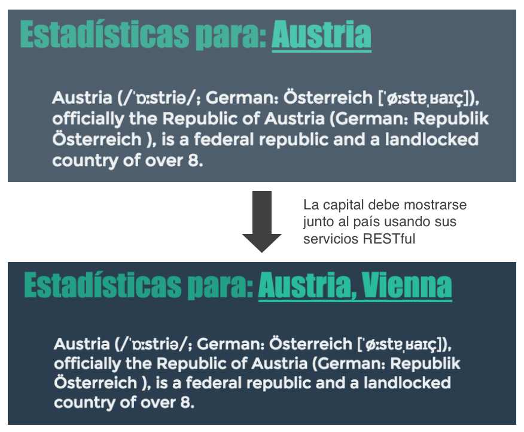
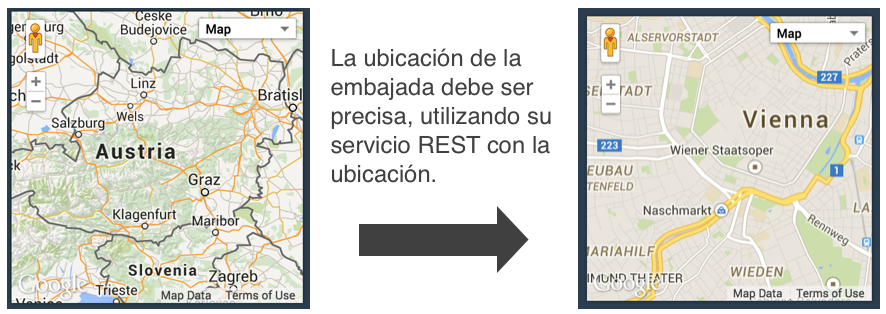
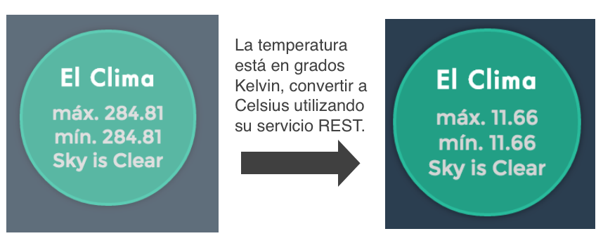
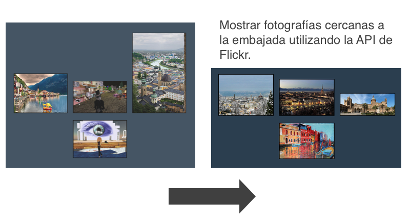

# Mashup

>Un mashup es una forma de integración y reutilización. Ocurre cuando una aplicación web ó servicio es usado o llamado desde otra aplicación con el fin de reutilizar su contenido y/o funcionalidad. Utilizando diversas fuentes, es posible para crear nuevos servicios, visualizado en una única interfaz gráfica. Por ejemplo, se pueden combinar las direcciones, fotografías y/o tweets con un mapa de Google Maps, fotografías de Flickr, y la API de Twitter para crear un mashup de un mapa interactivo.

# Contenido
- **[Antes de comenzar](#antesde)**
- [Conceptos basicos](#conceptosbasicos)
- [Herramientas sugeridas](#herramientas)
- [Instalación](#instalacion)
- **[Actividad 1 - Análisis, Llamando Servicios Web](#analisis)**
- **[Actividad 2 - Desarrollando un Mashup](#desarrollo)**
- **[Actividad 3 - Limpieza](#limpieza)**
- **[Actividad 4 - Preguntas](#preguntas)**

# Antes de comenzar

### <a name="conceptosbasicos"></a>Conceptos Básicos:
- A continuación se presentan enlaces a la documentación así como definiciones de algunos conceptos presentes en esta práctica:  
  - DOM (Modelo de Objeto de Documento) es una representación completamente orientada a objetos de una página web y permite acceder y actualizar el contenido, estructura y estilo de los documentos HTML con un lenguaje lenguaje tal como Javascript.
  
  - API es el conjunto de subrutinas, funciones y procedimientos que ofrece cierta biblioteca para ser utilizado por otro software como una capa de abstracción. Son usadas generalmente en las bibliotecas.

  - JSON, acrónimo de JavaScript Object Notation, es un formato ligero para el intercambio de datos. JSON es un subconjunto de la notación literal de objetos de JavaScript que no requiere el uso de XML.

  - JSONP es una técnica de comunicación utilizada en los programas JavaScript para realizar llamadas asíncronas a dominios diferentes. JSONP es un método concebido para suplir la limitación de AJAX entre dominios, que únicamente permite realizar peticiones a páginas que se encuentran bajo el mismo dominio y puerto por razones de seguridad.

  - AJAX, acrónimo de Asynchronous JavaScript And XML (JavaScript asíncrono y XML), es una técnica de desarrollo web para crear aplicaciones interactivas. Estas aplicaciones se ejecutan en el cliente, es decir, en el navegador de los usuarios mientras se mantiene la comunicación asíncrona con el servidor en segundo plano.

  - Access-Control-Allow-Origin Es un mecanismo que por cuestiones de seguridad permite o niega que varios recursos en un sitio web puedan ser solicitados desde otro dominio fuera del domino en donde la llamada fue solicitada.

### <a name="herramientas"></a>Herramientas sugeridas:
- **Eclipse**, **IntelliJ** u otro editor como <a href="https://atom.io/">(Atom)</a>.
- Si utilizan Mac es recomendable usar <a href="http://brew.sh/">**Homebrew**</a>.
- **JDK 6** ó superior.
- Conocimientos de Javascript, HTML, CSS.

### <a name="instalacion"></a>Instalación:

Para esta actividad se trabajará con la aplicación desarrollada previamente en Play, en la práctica [**Play-WebService**](https://github.com/Innova4DLab/Play-WebService)

# <a name="analisis"></a>Actividad 1 - Llamando Servicios Web

El objetivo de la práctica es implementar los servicios Web previamente desarrollados en la práctica [**Play-WebService**](https://github.com/Innova4DLab/Play-WebService) en una vista implementada en **Play**, utilizando **JavaScript**.

Existen diversas formas de llamar servicios Web, una de ellas es utilizando llamadas asíncronas al servidor utilizando **Ajax** *(Asynchronous Javascript and XML)*, éstas llamadas son muy fáciles de implementar utilizando la librería **jQuery**.

- Para comenzar, **Iniciar** el servidor de **Play Framework** en la terminal, navegando a la carpeta donde se encuentra el proyecto de la práctica [**Play-WebService**](https://github.com/Innova4DLab/Play-WebService)  y escribir:

```Bash
$ cd play-java
$ activator run
```
- Como en la práctica anterior, **Abrir** el **proyecto de Play** en el editor de su preferencia.
  - Como ya habiamos visto previamente, **Play Framework** utiliza estrictamente el patrón **Modelo-Vista-Controlador**, por lo que la parte de la vista, donde se desarrolla el despliegue de la interfaz, se lleva a cabo dentro de la carpeta **app/views**.
  - Para nuestra aplicación, las llamadas a los **servicios Web** las implementaremos del lado del **cliente**, utilizando llamadas asíncronas, por lo que nuestras actividades emplearán las tecnologías:  **HTML, CSS y JavaScript**.
- **Copiar** el contenido del archivo en *este repositorio* **index.scala(1).html** archivo del proyecto de **Play** dentro de la ruta **app/views/index.scala.html**.  

- **Modificar** el contenido del método "index()" que esta en controlador "Application.java" por la línea:

	  return ok(index.render("Servicios Web"));
    
- **Abrir** el navegador y escribir **localhost:9000** en la barra de direcciones.

### Explicación:

- **jQuery** es una librería **Javascript** que nos ayuda a simplificar mucho trabajo. para importarla es recomendable utilizar el servicio **CDN** *(content distribution network)* de **Google Hosted Libraries**, ejemplo:

```Javascript
<script src="http://ajax.googleapis.com/ajax/libs/jquery/1.11.2/jquery.min.js"></script>
```

Nuestra aplicación se divide en 3 partes, **(1) JavaScript**, **(2) CSS**, **(3) HTML**.
- En la sección de **Javascript** se definen métodos que escuchan eventos y ejecutan llamadas asíncronas para desplegar los resultados en el **DOM**. Estas funciones se implementan de manera simple gracias a **jQuery**.  
  - Analizar el código **JavaScript**.
  - Presta atención a la **documentación**.
  - **Analizar** el método [Click](https://api.jquery.com/click/) de jQuery.
  - **Analizar** el método [Ajax](http://api.jquery.com/jquery.ajax/) de jQuery.
  - **Analizar** el método [Append](https://api.jquery.com/append/) de jQuery.
  - **Explicar** en el reporte las funcionalidades de estos métodos y su uso en la aplicación.

- En la sección **< body >** del código **HTML** se definen algunos elementos del **DOM**, aquí es importante tener en cuenta los atributos **id** y **class** puesto que éstos son referenciados en el código **JavaScript** y **CSS**.
  - **Analizar** la relación entre el código **HTML** descrito dentro del tag **body** y el código **CSS** y **Javascript**.
  - **Explicar** en el reporte el uso de **id** y **class** dentro de los elementos **HTML**.

- La sección **CSS** está definida dentro del tag **< style >** en el documento **HTML**, aquí se define el *[look & feel](http://en.wikipedia.org/wiki/Look_and_feel)* de la aplicación.
  - **Analizar** el código CSS.
  - **Modificar** el código CSS, añadiendo tu propio estilo a la aplicación.
    - Una buena referencia es [W3Schools](http://www.w3schools.com/css/default.asp).
    - [CSS3 Cheat Sheet](http://www.smashingmagazine.com/wp-content/uploads/images/css3-cheat-sheet/css3-cheat-sheet.pdf)
  - **Explicar** en el reporte los atributos **CSS** utilizados en la aplicación.

### Actividad:

En el documento **index.scala(1).html** de este repositorio se han implementado dos de los **servicios Web** previamente elaborados en la práctica [**Play-WebService**](https://github.com/Innova4DLab/Play-WebService),   (**Multiplicación y Palíndromo**), a partir de ésto deberás:
  - **Desarrollar** en JavaScript las llamadas asíncronas a los servicios faltantes:
      - **Convertir** Pesos a Dólares.
      - **Convertir** grados Centigrados a Farenheit.
      - **Obtener** la capital dado un país.
      - **Obtener** la embajada mexicana dado un país.
  - **Desarrollar** en HTML los elementos necesarios para input/ouput del servicio Web.
  - **Desarrollar** en CSS un estilo para presentar de manera adecuada los servicios al usuario.
  - **Explicar** ampliamente en el reporte el desarrollo de la actividad.

# <a name="desarrollo"></a>Actividad 2 - Desarrollando un Mashup

Ahora que ya saben implementar un servicio Web y algunos conceptos básicos de **HTML y CSS** en la actividad 2 vamos a implementar un **Mashup**. Un **Mashup** es un conjunto de servicios, ya sean propios o de terceros que se unen para crear una aplicación completamente diferente, algunos servicios de terceros son ofrecidos por **Flickr, Wikipedia, WeatherReport, Google Maps**, etc.


Vamos a generar una aplicación que utilice todos estos servicios. Nuestra aplicación será una **WebApp** que permitirá ofrecer información sobre un país a las personas de negocios. Para esto ofreceremos un pequeño parrafo introductorio con la información del país **(Wikipedia)**, un pequeño mapa con la ubicación de la embajada **(Google Maps)**, el clima en la capital del país **(OpenWeather)**, una serie de fotografías relacionadas al país **(Flickr)**. Para esta actividad vamos a desarrollar una nueva vista, para esto es deberás seguir las siguientes instrucciones:
- **Cambiar** el nombre del archivo **index.scala.html** a **index.scala(act1).html**
- **Crear** un nuevo archivo **index.scala.html**
  - (Si están en **Atom**, pueden dar click derecho y seleccionar New file, ó pueden duplicar el anterior **index.scala.html**),
- **Copiar** el contenido del archivo **index.scala(2).html** que se encuentra **dentro de este repositorio** a **index.scala.html** del proyecto de Play.

- **Obtener una clave** válida para consultar el API de **OpenWeather**
  - Crear una cuenta de OpenWeather en https://home.openweathermap.org/users/sign_up
  - Obtener la clave en https://home.openweathermap.org/api_keys

- **Obtener una clave** válida para consultar el API de **Flickr**
  - Crear una cuenta de Flickr en https://www.flickr.com/signup
  - Crear una app no comercial en https://www.flickr.com/services/apps/create/noncommercial/
  - Obtener la clave de aplicación en https://www.flickr.com/services/apps

- **Obtener una clave** válida para consultar el API de **Google Maps**
  - Crear una cuenta de Google en https://accounts.google.com/SignUp
  - Crear una CLAVE presionando el botón "Crear credenciales" en https://console.developers.google.com/apis/credentials

- **Agregar las 3 claves** generadas en el documento index.scala.html
  - Abrir el documento index.scala.html
  - Cambiar la cadena "<API_KEY>" por la clave generada anteriormente de cada servicio Web (3)


En esta actividad vamos a **separar asuntos**, es decir, vamos a utilizar **CSS** para manejar únicamente el estilo, **HTML** para crear los elementos y **JavaScript** para implementar la lógica de la aplicación. Para hacer más claro el uso de *[Separation of concerns](http://en.wikipedia.org/wiki/Separation_of_concerns)* vamos a utilizar de la carpeta **public** de Play. La carpeta **public** es un directorio en donde el contenido es accesible por cualquiera que tenga acceso al servidor, es un lugar ideal para agregar imágenes que deseemos mostrar en la aplicación, código JavaScript y hojas de estilo CSS, ahora deberás:
- **Copiar** el contenido de la hoja de estilo **main(2).css** que se encuentra en este repositorio y pegar el contenido dentro de **public/stylesheets/main.css**

- **Analizar** el código, la principal diferencia en estos nuevos servicios es la integración de **API** de terceros, en algunos casos, como en la **API** de **Wikipedia** por cuestiones de seguridad se utiliza **JSONP**. Es por esto que al utilizar una API de un tercero es importante conocer la documentación. La **API** mas extensa es la API de **Flickr**.

### Documentación:

  - Documentación [Flickr](https://www.flickr.com/services/api/flickr.photos.search.html)
  - Documentación [Wikipedia](https://www.mediawiki.org/wiki/API:Main_page)
  - Documentación [OpenWeather](http://openweathermap.org/api)
  - Documentación [GoogleMaps](https://developers.google.com/maps/documentation/javascript/)

### Actividad:

En el documento **index.scala(2).html** de este repositorio se encuentra un Mashup en donde se han implementado algunos **servicios Web** desarrollados por terceros, **Google**, **Flickr**, **OpenWeather**, etc. El objetivo de la práctica es integrar los  servicios Web que ya desarrollaste en esta aplicación:

  - Utilizando **los servicios Web** previamente desarrollados en la actividad anterior, la nueva aplicación deberá:
    - **Mostrar** la capital al lado del país.

      

    - **Mostrar** en el mapa la ubicación de la embajada.
      

    - **Mostrar** la temperatura en grados Celsius.

      

    - **Mostrar** fotografías cercanas a la embajada mexicana para cada país.
      - **Revisar** la [documentación de Flickr](https://www.flickr.com/services/api/flickr.photos.search.html) para implementar la API utilizando latitud y longitud (Geolocalización).

      

    - **Explicar** ampliamente en el reporte los pasos seguidos para integrar los servicios.

# <a name="limpieza"></a> Actividad 3 - Limpieza
En el desarrollo de aplicaciones Web es importante mantener un estilo al programar, por esto deberás:
- **Nombrar** adecuadamente las variables y métodos.
- **Agregar** un comentario antes de un método para indicar su funcionamiento.
- **Comentar** las líneas de código que podrían ser no muy claras.
- **Realizar** un identado adecuado del código.
- **Revisar** el código para detectar usos inadecuados de variables ó errores al escribir.

Recordando que el estilo debe ser siguiendo las guías de [Google](https://google-styleguide.googlecode.com/svn/trunk/javascriptguide.xml) para **JavaScript**.

# <a name="preguntas"></a>Actividad 4 - Preguntas

Responder ampliamente a las siguientes preguntas en el reporte, tomando en cuenta todas las actividades realizadas en este repositorio.
  - ¿Qué es un **Mashup**?
  - ¿Cuál es la diferencia entre **Get** y **Post**?
  - Describe la utilidad de Ajax para llamar **servicios Web**.
  - Explica la utilidad del formato **Json**.
    - Explica la diferencia entre **Json** y **Jsonp**.
  - Explica la **separación de asuntos** en términos de desarrollo Web.
  - ¿Cómo se implementa el **patrón MVC** en **Play**?
    - ¿Qué se hace en el **controlador**?
    - ¿Cómo se implementa la **vista**?
    - ¿Cuál es la utilidad de la carpeta **public** en **Play**?
  - ¿Cómo se implementa la API de Google Maps?
    - ¿Por qué su implementación es diferente?

**Notas:** Explica ampliamente y justifica tus respuestas.

**Cualquier comentario o duda, discutir en la sección de [issues](https://github.com/Innova4DLab/webservices-mashup/issues).**
