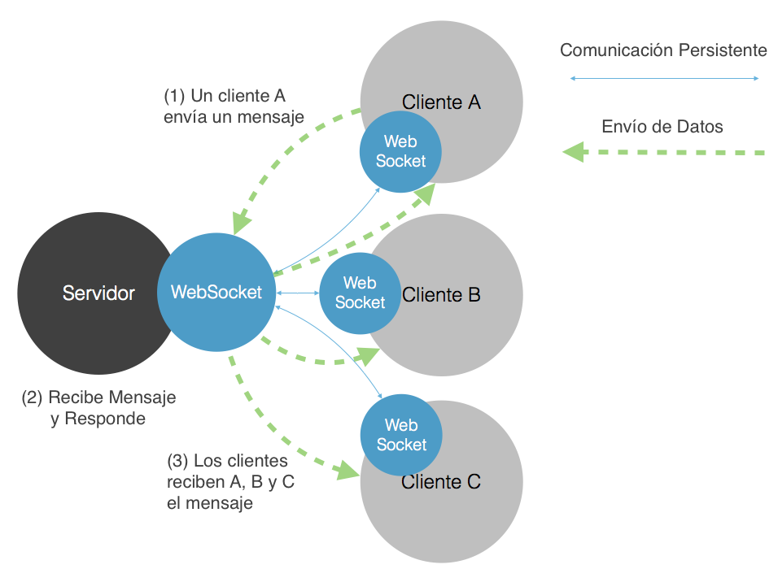
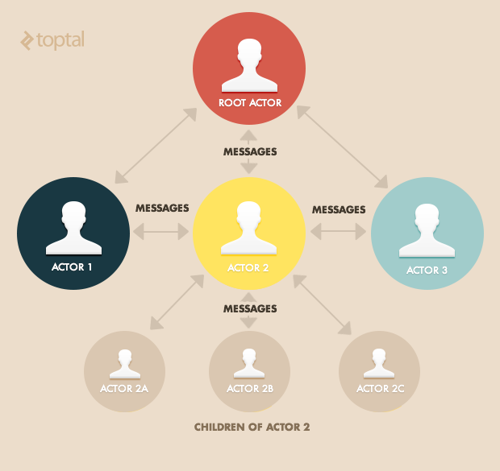
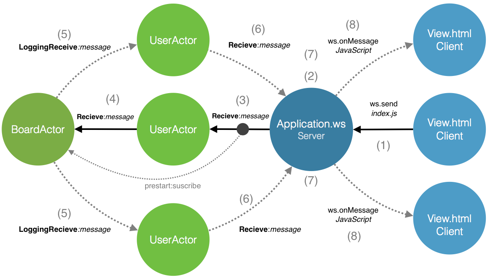
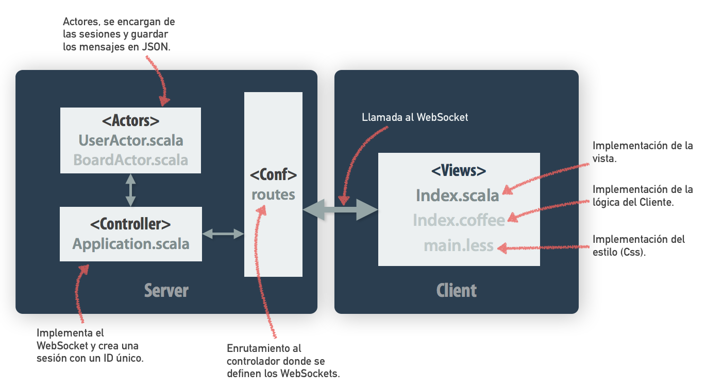
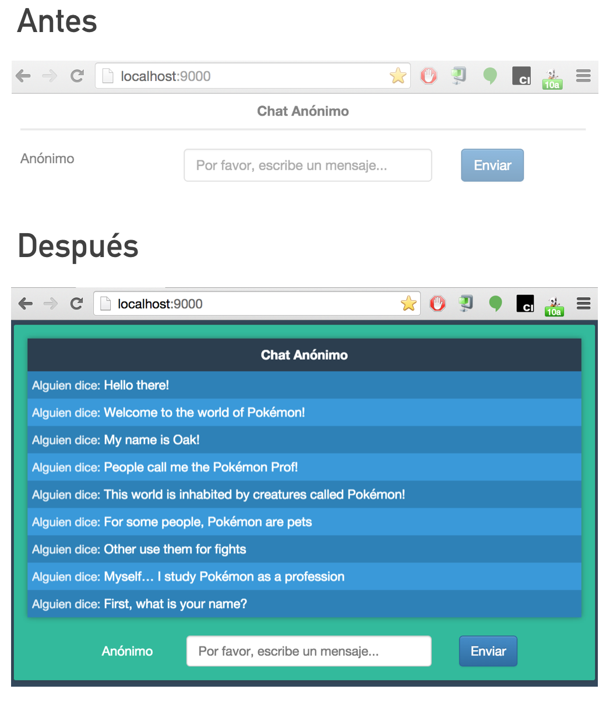

# WebSocket-Play-Actors

>El objetivo de la actividad es desarrollar los métodos necesarios para implementar un chat anónimo utilizando el  sistema de actores de Akka a través de Websockets con Play Framework.

>El modelo de actores es un modelo matemático de computación concurrente que trata como "actores" a los principios de la computación concurrente: En respuesta a un mensaje que un actor recibe el actor puede tomar decisiones, como por ejemplo, crear actores, enviar  mensajes y/o determinar como responder al siguiente mensaje. El modelo de actores adopta como filosofía que *todo es un actor*. Éste concepto es similar al de *todo es un objeto* utilizado en el paradigma orientado a objetos pero difiere en cuanto a que en un modelo orientado a objetos, el cómputo se ejecuta típicamente de manera secuencial, mientras que el modelo de actores es en esencia concurrente.



# Contenido
- **[Antes de comenzar](#antesde)**
- [Herramientas sugeridas](#herramientas)
- [Instalación](#instalacion)
- **[Introducción](#analisis)**
- **[Actividad 1 - Desarrollo](#desarrollo)**
- **[Actividad 2 - Limpieza](#limpieza)**
- **[Actividad 3 - Preguntas](#preguntas)**

# Antes de comenzar
### <a name="herramientas"></a>Herramientas sugeridas:
- **Eclipse**, **IntelliJ** u otro editor como <a href="https://atom.io/">(Atom)</a>.
- Si utilizan Mac es recomendable usar <a href="http://brew.sh/">**Homebrew**</a>.
- **JDK 6** ó superior.
- Conocimientos de **Javascript**.

### <a name="instalacion"></a>Instalación:

La actividad se encuentra **en este repositorio** por lo que deberás **clonar** este repositorio en tu computadora utilizando Git.

- **Clonar** el proyecto mediante:
```Bash
$ git clone https://github.com/Innova4DLab/websocket-play-actors.git
```
- **Ejecutar** el proyecto con:
```Bash
$ activator run
```
- **Abrir** el navegador en: http://localhost:9000/
- Por el momento deberías ver **errores al compilar la aplicación**, puesto que se encuentra incompleta, continua la actividad para resolver estos problemas.
- **Abrir** la carpeta del proyecto en un editor de su preferencia.

# <a name="analisis"></a>Introducción - Modelo de Actores

**Nota:** *Para realizar esta práctica deberás haber concluido la práctica anterior en la cual aprendiste a desarrollar un chat anónimo desde la perspectiva del cliente. En esta práctica aprenderás a desarrollar la parte que se implementa en el servidor.*

En **el problema de los filósofos**, recordarás que escribir programas concurrentes no es una tarea sencilla. Tratar con **locks** y **threads** es una actividad en donde es altamente probable aparezcan errores, en muchos de los casos el código de aplicaciones concurrentes es difícil de leer, probar y mantener.

Es por esto que muchas personas prefieren evitar la concurrencia y en su lugar desarrollan algoritmos que se ejecutan en un **solo proceso secuencial**, confiando en servicios externos de terceros para administrar operaciones concurrentes asíncronas. La mayoría de las veces estas alternativas son viables, pero en algunos casos los sistemas requieren respuestas inmediatas y depender de terceros es una solución arriesgada.

Afortunadamente existe **Akka**. Akka es una librería integrada completamente con el lenguaje de programación **Scala**. Akka permite la construcción de aplicaciones concurrentes, distribuídas y tolerantes a fallas. La siguiente figura ilustra la comunicación entre actores, en donde podemos observar la comunicación entre actores mediante mensajes, además de la jerarquía de actores. La jerarquía de actores los hace tolerantes a fallas puesto que si un actor hijo llegara a fallar, este transmite la responsabilidad a su superior y así sucesivamente hasta llegar al root:



El modelo de actores en nuestra aplicación permite la concurrencia de mensajes, es decir, el servidor recibe mensajes de chat, asigna a cada usuario (**UserActor**) un id único secuencial, posteriormente concentra los mensajes en un único actor (**BoardActor**), el cual se encarga de enviar el mensaje a los demás actores y posteriormente los envía mediante WebSocket a los clientes. En el siguiente diagrama se ilustra el comportamiento de los **actores** al realizarse un envío de mensaje desde el cliente.



# <a name="desarrollo"></a>Actividad 1 - Desarrollo Server-WebSocket
El objetivo de la actividad es desarrollar los métodos necesarios para implementar un sistema de actores en el servidor. Deberás **analizar** y **complementar** el código de las clases que aquí se presentan dentro del proyecto incluído en este repositorio. A continuación vamos a desarrollar el código en el controlador que está definido en **controllers/Application.scala**:

### Application.scala

Como se observa en **conf/routes** el método **index** se ejecuta automáticamente al cargar localhost:9000

```scala
GET     /                           controllers.Application.index
GET     /ws                         controllers.Application.ws
```

Se genera un ID único para la sesión. La variable UID solicita el id de la sesión **request.session.get(UID)** en caso contrario (**getOrElse**) ejecuta la función anónima. En donde se genera un número consecutivo para la sesión mediante un contador.

Además, el método **(index)**, retorna una respuesta **HTTP (Ok)** en donde el método **OK** envía el valor **uid** a la vista en **Views.html.index** el valor de @uid.


- **Analizar** el diagrama y agregar el siguiente código en **Application.scala**

```scala
def index = Action { implicit request => {
  val uid: String = request.session.get(UID).getOrElse {
    counter += 1
    counter.toString
  }
  Ok(views.html.index(uid)).withSession {
    Logger.debug("Se creó un UID: " + uid) //Esto se muestra en la terminal de Play.
    request.session + (UID -> uid) //Asignamos el valor de uid a UID.
  }
}}
```

El siguiente método implementa un **Websocket** que recibe dos valores,
en caso de que la petición **HTTP** sea exitosa (**Future.succesful**), se solicita el ID
único de la sesión del usuario, en caso que no exista un ID, el servicio se prohíbe.
En caso que el ID exista se llama al método **UserActor.props** definido dentro de la carpeta
actores.

- El Websocket espera una conexión.
- En caso de éxito, solicita un id.  (request.session.get(UID))
- Si el id no existe (None) entonces envía una respuesta HTTP (Forbidden)
- Si existen un id (Some(uid)) entonces se invoca al actor UserActor.props(uid)

```scala
def ws = WebSocket.tryAcceptWithActor[JsValue, JsValue] { implicit request =>
  Future.successful(request.session.get(UID) match {
    case None => Left(Forbidden)
    case Some(uid) => Right(UserActor.props(uid))
  })
}
```

- Antes de comenzar el análisis del código Scala se presentan definiciones de algunos conceptos presentes en esta práctica:
  - [ActorRef](http://doc.akka.io/docs/akka/current/general/addressing.html): Es una referencia de un actor akka que tiene como finalidad apoyar el envío de mensajes al actor que representa.
  - [Apply()](https://twitter.github.io/scala_school/basics2.html#apply): Es una función especial que permite invocar directamente al objeto que la contiene como si se tratara de una función.
  - [Set](http://docs.scala-lang.org/overviews/collections/sets.html): Es una colección de datos del mismo tipo que no contiene elementos duplicados. 
  - [Map](https://emilvarga.com/posts/2016/04/10/map-and-flatmap): Es un iterador que permite evaluar una función a cada elemento de una colección y retorna una colección con el resultado de la evaluación de cada elemento.
  - [Lazy val](https://blog.codecentric.de/en/2016/02/lazy-vals-scala-look-hood/): Es un valor que es evaluado hasta que es accedido por primera vez, este es evaluado una sola vez.
  - [JSValue](https://www.playframework.com/documentation/2.5.x/ScalaJson): Es un trato que representa tipo de datos JSON y contiene utilidades que permiten el acceso y validación de estas estructuras.
  - [Case class](https://twitter.github.io/scala_school/basics2.html#caseclass): Es un especial tipo de clase al cual el compilador automáticamente agrega útiles métodos a esta y es empleada para pattern matching y definición de datos. 
  - [Pattern Matching](http://docs.scala-lang.org/tutorials/tour/pattern-matching.html): Scala tiene un mecanismo que permite hacer coincidir cualquier tipo de dato con varios patrones (parecido a un switch case), cada patron apunta a una expresión. La expresion que esta asociada con el primer patron coincidente será ejecutada.

### UserActor.scala
Esta clase define un actor. **UserActor** funciona como una puerta de enlace entre los actores conectados al Chat y al websocket. Este actor envía mensajes a **BoardActor.scala** y al **WebSocket**.


- Antes que nada **UserActor** se suscribe a **BoardActor**, así podemos informarle a **BoardActor** sobre éste nuevo actor y estará listo para recibir sus mensajes.

- **Analizar** el diagrama y agregar el siguiente código en **UserActor.scala**

```scala
override def preStart() = {
  BoardActor() ! Subscribe
}
```
Como habrás analizado, los actores son entidades que se suscriben y reciben mensajes, cuando UserActor recibe un mensaje a través del WebSocket, crea un JSON. El documento JSON pasa es envíado mediante **out** a **BoardActor**.

- **Analizar** el diagrama y agregar el siguiente código en **UserActor.scala**

```scala
def receive = LoggingReceive {
  case Message(muid, s) if sender == board => {
    val js = Json.obj("type" -> "message", "uid" -> muid, "msg" -> s)
    out ! js
  }
  case js: JsValue => (js \ "msg").validate[String] map { Utility.escape(_) }  map { board ! Message(uid, _ ) }
  case other => log.error("Error, no se creó el objeto JSON: " + other)
}
```
Por último definimos el objeto **UserActor** el cual recibe un id y envía a **BoardActor** un JSON.

- Analizar y agregar el siguiente código en **UserActor.scala**

```scala
object UserActor {
  def props(uid: String)(out: ActorRef) = Props(new UserActor(uid, BoardActor(), out))
}
```

### BoardActor.scala

**BoardActor** es un actor que recibe mensajes desde cada UserActor y los envía a los demás. Después cada actor envía sus mensajes a través del WebSocket.



Primero debemos definir el comportamiento cuando el actor recibe un mensaje, cuando el mensaje es una subscripción BoardActor agrega al usuario en su lista (Set) y comienza a observar al actor. En caso de recibir un mensaje revisa su lista de usuarios y envía el mensaje a todos. Por último cuando un usuario termina su sesión el actor **BoardActor** lo retira de su lista.

En resumen:

- Cuando se envía un mensaje se agrega el usuario al Set
- Cuanto se termina la sesión se remueve el actor del Set
- Cuando se suscribe un actor se agrega el usuario al Set
- **Analizar** el diagrama y **agregar** el siguiente código en **BoardActor.scala**

```scala
def receive = LoggingReceive {
  case m:Message => users map { _ ! m} //Recibe el mensaje y lo envía a los actores suscritos
  case Subscribe => {
    users += sender // Agregar a usuarios al sender.
    context watch sender // Observar al sender
  }
  case Terminated(user) => users -= user
}
```

Por último defimos la variable Board la cual es de tipo Lazy (Indica al compilador que solo instancie una vez).

```scala
object BoardActor {
  lazy val board = Akka.system().actorOf(Props[BoardActor])
  def apply() = board // Cuando un actor se suscribe retorna Board.
}
```

El **Chat Anónimo** ahora está completo, lo puedes usar desde diferentes navegadores para experimentar como **WebSocket** y **Akka** atienden las peticiones de todos los clientes. **Nota**, las sesiones de Play se mantienen en el navegador, por lo que para simular diferentes clientes deberás abrir otro navegador o ejecutar **Chrome** ó **Safari** en modo **incógnito**.

**Finalmente** la aplicación debería verse así:



### Agregar un Timestamp

Por último agregaremos un timestamp, del momento en el que el servidor recibe el mensaje, para esto deberemos modificar nuestro **UserActor.scala** para que cuando se genere el objeto JSON agregue un campo con un timestamp.

Por lo que deberás:
- **Importar** las librerías:

```scala
import java.util.Calendar
import java.text.SimpleDateFormat
```
- **Agregar** el siguiente código antes de crear el objeto JSON.

```scala
val today = Calendar.getInstance().getTime()
```
- **Extraer** el formato de la fecha agregando el siguiente código:

```scala
val hour  = new SimpleDateFormat("hh").format(today)
val ampm  = new SimpleDateFormat("a").format(today)
val minute  = new SimpleDateFormat("mm").format(today)
val seconds = new SimpleDateFormat("s").format(today)
val miliseconds = new SimpleDateFormat("S").format(today)
```

- **Concatenar** en una variable time:

```scala
val time = hour + ":" + minute + ":" + seconds + ":" + miliseconds + " " + ampm
```

- **Modificar** el objeto JSON

```scala
val js = Json.obj("type" -> "message", "uid" -> muid, "msg" -> s, "timestamp" -> time)
```

Listo, ya tenemos un nuevo objeto JSON que envía información adicional al cliente, ahora debemos modificar el cliente, solo deberemos modificar nuestro **assets/javascript/index.js** para tomar la propiedad **timestamp** del objeto **JSON** de la siguiente manera:

```javascript
return $("#board tbody").append("<tr><td class='user'>Usuario#"+ message.uid +" dice:</td><td>"+ message.msg + "</td><td class='timestamp'>"+message.timestamp+"</td></tr>");
```
**Finalmente** la aplicación debería verse así:


# <a name="limpieza"></a> Actividad 2 - Limpieza

La limpieza en este proyecto consiste en documentar el código en Scala, para esto deberás seguir las guías de ScalaDocs. puedes basarte en las descripciones presentadas en esta práctica.

- **Nombrar** adecuadamente las variables y métodos.
- **Agregar** un comentario antes de un método para indicar su funcionamiento.
- **Comentar** las líneas de código que podrían ser no muy claras.
- **Realizar** un identado adecuado del código.
- **Revisar** el código para detectar usos inadecuados de variables ó errores al escribir.

Recordando que el estilo de documentación debe ser siguiendo las guías de [ScalaDocs](http://docs.scala-lang.org/style/scaladoc.html).

# <a name="preguntas"></a>Actividad 3 - Preguntas

Responder ampliamente a las siguientes preguntas en el reporte, tomando en cuenta todas las actividades realizadas en este repositorio.

- **Explica** el modelo de actores
- ¿Un chat es una aplicación concurrente?
- Explica como harías un Chat sin el modelo de actores
- Explica como harías un Chat sin Websocket
- ¿Qué sucede cuando un actor recibe un mensaje?
- ¿Que representa **UserActor**?
- ¿Por qué es necesario el uso de **WebSockets**?
- ¿Cuál es el objetivo de **BoardActor**?
- ¿Cuál es el significado de Future en el método **Application.ws**?
- ¿En qué momento se ejecuta el método **Application.index**?
- Explica el uso de la variable **users** dentro de **BoardActor.scala**

**Notas:** Explica ampliamente y justifica tus respuestas.

**Cualquier comentario o duda, discutir en la sección de [issues](https://github.com/Innova4DLab/websocket-play-actors/issues).**
