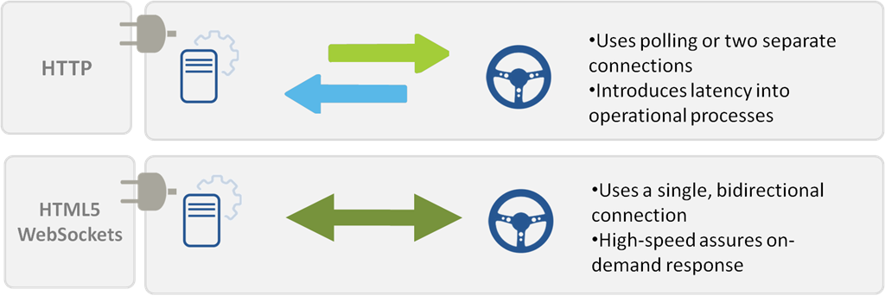
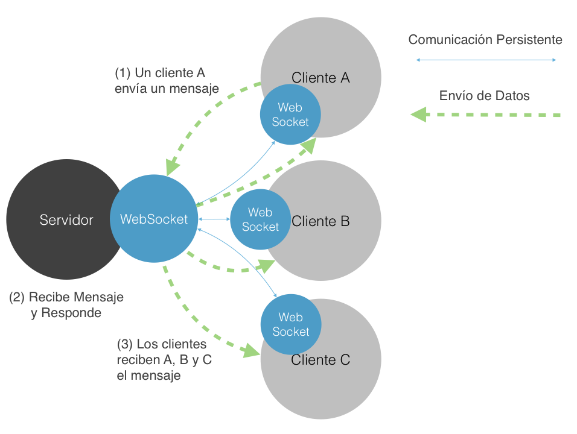

# WebSocket-Play

>Esta es una simple aplicación que implementa un chat anónimo, utilizando webSockets, además se ilustra el uso de actores con Akka y Play Framework. La especificación WebSocket define un API que establece conexiones "socket" entre un navegador web y un servidor. Dicho con otras palabras: existe una conexión persistente entre el cliente y el servidor, y ambas partes pueden empezar a enviar datos en cualquier momento.

# Contenido
- **[Antes de comenzar](#antesde)**
- [Herramientas sugeridas](#herramientas)
- [Instalación](#instalacion)
- **[Actividad 1 - Análisis](#analisis)**
- **[Actividad 2 - Desarrollo](#desarrollo)**
- **[Actividad 3 - Limpieza](#limpieza)**
- **[Actividad 4 - Preguntas](#preguntas)**

# Antes de comenzar

### <a name="herramientas"></a>Herramientas sugeridas:
- **Eclipse**, **IntelliJ** u otro editor como <a href="https://atom.io/">(Atom)</a>.
- Si utilizan Mac es recomendable usar <a href="http://brew.sh/">**Homebrew**</a>.
- **JDK 6** ó superior.
- Conocimientos de **Javascript**.

### <a name="instalacion"></a>Instalación:

La actividad se encuentra **en este repositorio** por lo que deberás **clonar** este repositorio en tu computadora.

- **Clonar** el proyecto mediante:
```Bash
$ git clone https://github.com/Innova4DLab/DistributedSystems.git
```

- **Acceder** a la práctica mediante:
```Bash
$ cd websocket-play
```

- **Ejecutar** el proyecto con:
```Bash
$ activator run
```
- **Abrir** el navegador en: http://localhost:9000/
  - Por el momento deberías ver **errores al compilar la aplicación**, puesto que se encuentra incompleta, continua la actividad para resolver estos problemas.
- **Abrir** la carpeta del proyecto en un editor de su preferencia.

# <a name="analisis"></a>Actividad 1 - Análisis

**WebSocket** es un protocolo que provee canales de  comunicación bidireccional sobre una conexión TCP única. Desde el 2011 el protocolo es un estándar y la API Web está en proceso de estandarizarse por la W3C.



Los **WebSockets** utilizan un único canal de comunicación bidireccinal en donde se asegura una alta velocidad de intercambio de datos en demanda.

### Estructura de la Aplicación

La **aplicación** se encuentra desarrollada en Scala y JavaScript. A continuación se muestra un diagrama con la estructura del proyecto:


La naturaleza de **Play Framework** nos permite mantener un orden en la
estructura de la aplicación. El uso del patrón **Modelo Vista Controlador** es muy claro, puesto que Play separa las características de la **vista** (HTML, CSS), de la implementación de  los **WebSockets**. Cabe mencionar que debido a la naturaleza de Play para desarrollar fácilmente métodos REST a partir del controlador es muy fácil desarrollar servicios como WebSocket. A continuación se muestra la arquitectura de la aplicación.


Ahora que has observado las características de la aplicación, explica el resultado de tu análisis ampliamente en tu reporte respondiendo a las siguientes preguntas.

- **Analizar** la estructura del proyecto en Play Framework.
  - ¿Cuál es el objetivo de la carpeta **App**?
  - ¿Cuál es el objetivo del patrón **Modelo Vista Controlador**?
- **Analizar** la arquitectura Cliente-Servidor del proyecto.
  - **Identificar** el Cliente y explicar su objetivo.
  - **Identificar** el Servidor y explicar su objetivo.
- ¿Cómo se relacionan conf/routes y app/controllers/Application.scala?
- **Analizar** la vista (carpeta Views en Play)
  - ¿Cuál es la utilidad del atributo **data-ws-url**?

A continuación se listan algunas tecnologías utilizadas en este proyecto, que no son explotadas en su totalidad pero son interesantes de analizar y considerar para futuros desarrollos:

- [Bootstrap](http://getbootstrap.com/) es un framework para el **front-end**, es una colección de herramientas para desarrollar sitios Web responsivos (tanto para dispositivos móviles como para escritorio). **Bootstrap** incluye templates en HTML y CSS para agregar componentes, como botones, formularios, tipografías y componentes de navegación que pueden utilizarse instantáneamente.

- [Akka](http://akka.io/) Es un toolkit open-source para simplificar la construcción de aplicaciones concurrentes y distribuídas bajo la JVM. **Akka** soporta diferentes modelos de programación para implementar concurrencia, especialmente el modelo basado en actores.

- [Scala](http://www.scala-lang.org/) es un lenguaje de programación multi-paradigma diseñado para expresar patrones comunes de programación en forma concisa, elegante y con tipos seguros. Integra sutilmente características de lenguajes funcionales y orientados a objetos. La implementación actual corre en la máquina virtual de Java y es compatible con las aplicaciones Java existentes.

# <a name="desarrollo"></a>Actividad 2 - Cliente-WebSocket

Ahora que hemos analizado y comprendido la estructura de la aplicación es momento de implementar los **WebSockets**, por ahora no debes preocuparte por los actores. Analizaremos el modelo de actores en una actividad posterior.

El objetivo de la Actividad 2 es comprender la implementación de **WebSockets** desde el lado del Cliente, es decir, cómo se envían mensajes a un Servidor y su implementación en JavaScript. Desarrollando un pequeño **Chat Anónimo**.

Como podrás observar en la carpeta **assets/javascripts** se encuentra un archivo **index.js** el cuál se encuentra vacío. Como habrás notado en tu análisis, ya se encuentra (mayormente) desarrollado el código del WebSocket en Scala, de hecho, si observas el archivo conf/routes podrás observar como se ha definido un servicio REST de la siguiente manera:

```Bash
GET     /ws                         controllers.Application.ws
```

Este es el Servicio del **WebSocket**, listo para ser implementado en el cliente, por lo que podemos comenzar a utilizarlo directamente en nuestra aplicación. Para comenzar estableceremos el canal de comunicación entre el cliente y el servidor. Para esto implementa el código que se muestra a continuación dentro de **assets/javascripts/index.js**

### Recibiendo Datos

```Javascript
var ws;
ws = new WebSocket($("body").data("ws-url")); //Se toma La URL del Tag en Body
ws.onmessage = function(event) {
  var message;
  message = JSON.parse(event.data);
  switch (message.type) {
    case "message":
      return $("#board tbody").append("<tr><td>"+ message.msg + "</td></tr>");
    default:
      return console.log(message);
  }
};
```
El fragmento de código anterior realiza una conexión al **WebSocket** definido en el servidor, cada vez que el servidor envía información, se muestra en el cliente como una fila dentro de una tabla.

Ahora enviemos datos a través del formulario, de igual forma copia el siguiente fragmento de código.

### Enviando Datos

```Javascript
$("#msgform").submit(function(event) {
  event.preventDefault();
  console.log($("#msgtext").val());
  ws.send(JSON.stringify({ //Enviar el mensaje en el formulario como JSON.
    msg: $("#msgtext").val()
  }));
  return $("#msgtext").val("");
});
```

Listo, ahora deberías poder comunicarte con el **WebSocket**, pruébalo ahora envíando un mensaje desde el formulario de la interfaz y haciendo click en el botón **Enviar** ¿Qué es lo que pasa aquí?, la siguiente imagen ilustra las acciones del **Websocket:**


Por el momento el **Chat Anónimo** lo puedes usar al mismo tiempo desde diferentes navegadores ó pestañas para experimentar como el WebSocket atiende las peticiones de todos los clientes.

### Enviar datos

Ahora te toca a tí, dado lo que has aprendido con WebSockets, deberás simular a otra persona enviando mensajes:

- **Desarrollar** una función JavaScript, que permita enviar mensajes a través del WebSocket al servidor cada 5 segundos, puedes extraer los mensajes de este arreglo:

```Javascript
var speech = ["Hello there!","Welcome to the world of Pokémon!",
              "My name is Oak!","People call me the Pokémon Prof!",
              "This world is inhabited by creatures called Pokémon!",
              "For some people, Pokémon are pets",
              "Other use them for fights",
              "Myself… I study Pokémon as a profession",
              "First, what is your name?"];
```
  - La función **window.setInterval** podría ser de utilidad:

```Javascript
window.setInterval(function(){
  /*
   * Código Websocket
   */
}, 4000); // Tiempo en milisegundos

```
- **Desarrollar** la interfaz de usuario de la aplicación (Con CSS y Html)
  - La aplicación final debería verse más o menos así:


- **Explicar** ampliamente en el reporte los pasos que seguiste para el desarrollo de la aplicación.

# <a name="limpieza"></a> Actividad 3 - Limpieza
En el desarrollo de aplicaciones Web es importante mantener un estilo al programar, por esto deberás:
- **Nombrar** adecuadamente las variables y métodos.
- **Agregar** un comentario antes de un método para indicar su funcionamiento.
- **Comentar** las líneas de código que podrían ser no muy claras.
- **Realizar** un identado adecuado del código.
- **Revisar** el código para detectar usos inadecuados de variables ó errores al escribir.

Recordando que el estilo debe ser siguiendo las guías de [Google](https://google.github.io/styleguide/jsguide.html) para **JavaScript**.

# <a name="preguntas"></a>Actividad 4 - Preguntas

Responder ampliamente a las siguientes preguntas en el reporte, tomando en cuenta todas las actividades realizadas en esta práctica.
  - ¿Qué es **WebSocket**?
  - ¿Cuál es la diferencia entre **WebSocket** y **Servicios REST**?
  - ¿Cómo se establece una conexión con **WebSocket**?
  - Explica la integración de datos en la interfaz utilizando **JavaScript**.
  - ¿Cómo se implementa el **patrón MVC** en esta aplicación?
    - ¿Qué se hace en el **controlador**?
    - ¿Cómo se implementa la **vista**?
  - Explica el comportamiento del WebSocket cuando envías mensajes cada 5 segundos al servidor.

**Notas:** Explica ampliamente y justifica tus respuestas.

**Cualquier comentario o duda, discutir en la sección de [issues](https://github.com/Innova4DLab/websocket-play/issues).**
